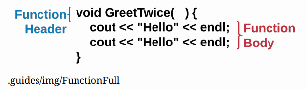
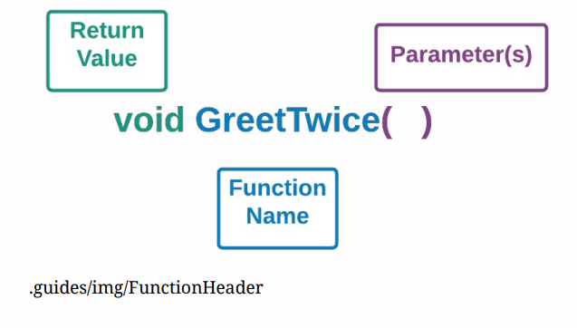
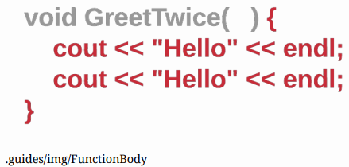
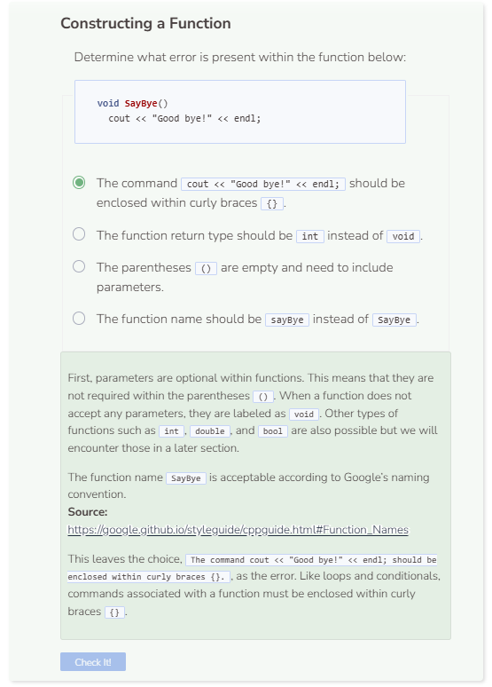

# Function Definition
## Function Syntax
You have seen and used built-in functions like the length function (`my_string.length()`). This unit deals with user-defined functions. Functions are composed of two parts, the header and the body.

The function header may contain several keywords to determine the function type. Next is the name of the function. “Ordinarily, functions should start with a capital letter and have a capital letter for each new word.”

(https://google.github.io/styleguide/cppguide.html#Function_Names). 

Some examples include: `GreetTwice`, `AddThree`, `FindArea`, etc. Parentheses are required but the parameter(s) within them are not. Any command(s) associated with the function should be indented as a best practice and enclosed within curly braces `{}`. This command(s) comprises the body of the function.

## Function Header

The function header usually contains a few key labels:
- `void` - Determines whether there is a return value or not for the function. If the function has no return value, use **void**. If the function returns an integer, use **int**, etc.
- `GreetTwice` - This is an example of a function name. See above for naming conventions.
- `()` - Parentheses are required for all functions. Any parameters that the function takes in will go into the parentheses but they are optional.

## Function Body

The function body is the list of actions the function performs. All of the code for the function body should be enclosed within curly braces `{}` and indented as a best practice to show association. This convention is similar to how conditionals and loops are written.

