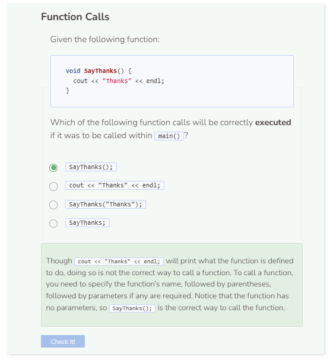

# Function Calls
## Calling a Function

```cpp
#include <iostream>
using namespace std;

void GreetTwice() {
    cout << "Hello" << endl;
    cout << "Hello" << endl;
}
```

You’ll notice that an error is produced. This happens because when running C++ programs, a `main` function is required. Let’s go ahead and add `int main()` to the code like so.

```cpp
#include <iostream>
using namespace std;

void GreetTwice() {
    cout << "Hello" << endl;
    cout << "Hello" << endl;
}
int main() {

}
```

Nothing is outputted when the program is executed. This happens because creating a function alone does not cause C++ to run it. You have to explicitly call the function if you want it to run. Functions are usually called within the main function. To call a function, simply start with its name, provide any parameters if needed, and end with a semicolon.

```cpp
#include <iostream>
using namespace std;

void GreetTwice() {
    cout << "Hello" << endl;
    cout << "Hello" << endl;
}

int main() {
    GreetTwice();
    return 0;
}
```

You may have noticed that adding `return 0` to `main()` in the code above doesn’t really cause any changes to the program. In older versions of
C++, the command `return 0` was required because the `main()` function has a return type of `int`. This means that the function expects some
integer value to be returned at the end of the function. `return 0` is another way for the program to denote that the function has successfully completed.

Newer versions of C++ can run `int main()` without `return 0`, however, it is still a best practice to include it. Additionally, you should not
change the return type of `main()` to anything other than `int`. This is a standard in C++ and should remain so.

## Order of Function Definitions

The order of function definitions is important in C++. If the code is changed to the following, what do you think will be outputted?

```cpp
#include <iostream>
using namespace std;

void GreetTwice() {
    cout << "Goodbye" << endl;
    cout << "Hello" << endl;
    cout << "Hello" << endl;
}

int main() {
    GreetTwice();
    GreetTwice();
    return 0;
}
```

Like how a regular C++ program runs, the function is executed line by line from top to bottom. Thus, the order of statements within the function will determine what actions are performed first, second, etc.

## Order of Different Functions
The order of the functions themselves also matter. What happens if you swap the position of `main()` with `GreetTwice()` and vice versa?

```cpp
#include <iostream>
using namespace std;

int main() {
    GreetTwice();
    GreetTwice();
    return 0;
}

void GreetTwice() {
    cout << "Goodbye" << endl;
    cout << "Hello" << endl;
    cout << "Hello" << endl;
}
```

You will encounter an error such as `GreetTwice was not declared in this scope`. Like how function definitions are read line by line from top to bottom, functions are also read the same way. When the program gets to the first `GreetTwice();` within `main()`, it doesn’t know what to do because the function has not been declared yet. Therefore, whenever you call a function, make sure that you have already declared and defined it. Think of a function as a vocabulary word, you would not use a vocabulary word that you do not know the definition of.



