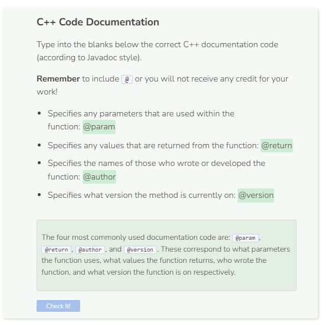

# Documentation
## C++ Code Documentation
Including C++ code documentation prior to function definitions is standard. Doing so enables users to gain clarity on the purpose of the function, any
parameters that are used, and what the function returns. Users can also see who wrote the function as well as what version the function is on. There
are several ways to document C++ code, however the style that we will be using for this module models that of Java’s (also known as Javadoc). Here is
an example, also present within the text editor to your left:

```cpp
/**
* This is an example of C++ documentation
*
* @author FirstName LastName
* @version 1.0
*/
#include <iostream>
using namespace std;
/**
* This function greets the user twice
*
* @param specify parameters if any
* @return specify return value if any
*/
void GreetTwice() {
    cout << "Hello" << endl;
    cout << "Hello" << endl;
}

int main() {
    GreetTwice();
    return 0;
}
```

The C++ code documentation does not affect the output of the code. However, it provides more clarity to how the function is used. Generally
speaking, the documentation for authors and program version goes at the start of the program while the documentation for parameters and return
value goes directly before the declared function. Note that documentation for the `main()` function is not required.

## Doxygen Tool
There is an online tool called Doxygen that can help generate C++ code documentation. For more information, you may visit the Doxygen website
at this link: [Doxygen](https://www.doxygen.nl/index.html). However, for the purposes of this module, we will only focus on self-created documentation. In particular, we will be using mostly @param for parameters and @return for return values to document our functions.


