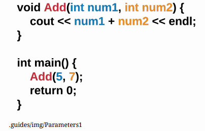
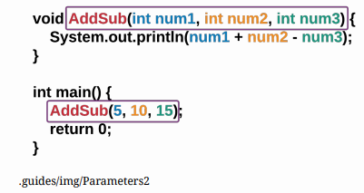
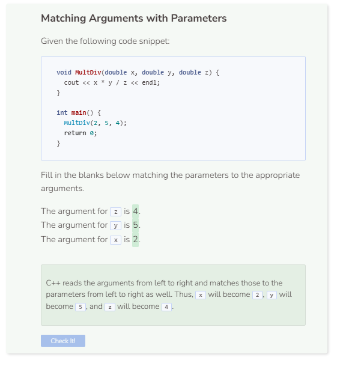

# Passing Parameters
## Parameters
If a function contains parameters within its definition, they are required to be present when the function is called. In the example below, the function,
`Add()`, adds two integer parameters together. Parameters are the types or values located in between the parentheses. Multiple parameters are separated by commas.



```cpp
/**
* This function adds two integers together
*
* @param num1 The first integer
* @param num2 The second integer
*/
void Add(int num1, int num2) {
    cout << num1 + num2 << endl;
}
```

- The number of arguments within `main()` should match the number of parameters specified in the function. If there are three parameters, then there should be three arguments as well.

- The argument type should also match the parameter type. If the function requires three integers, then the arguments should also consist of three integers. You cannot provide a string argument for an integer parameter, etc.

## Order of Parameters



Much like how C++ programs run code from left to right and then top to bottom, parameters are also read the same way. Because of this, the order of parameters is important. The first argument in the function call will be matched with the first parameter in the function header, the second argument from the function call will be the second parameter in the function header, etc. 

```cpp
#include <iostream>
using namespace std;
/**
* This function adds the first two integers together,
* then subtracts the third integer
*
* @param num1 The first integer
* @param num2 The second integer
* @param num3 The third integer
*/
void AddSub(int num1, int num2, int num3) {
    cout << num1 + num2 - num3 << endl;
}

int main() {
    AddSub(5, 10, 15);
    return 0;
}
```




