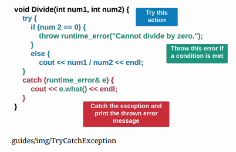
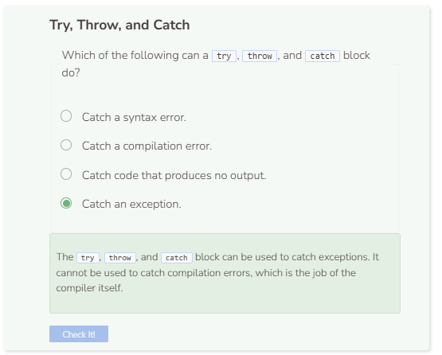

# Checking Parameters
## Checking Parameter Usage

```cpp
/**
* This function divides one integer by the other
*
* @param num1 The first integer
* @param num2 The second integer
*/
void Divide(int num1, int num2) {
    cout << num1 / num2 << endl;
}

int main() {
    Divide(5, 0);
    return 0;
}
```

You’ll notice that the code produces an exception. An exception occurs when an operation cannot be successfully completed because a rule is broken. For example, dividing by 0 results in an undefined answer. Thus when you try to divide 5 by 0, you get an exception as a response. Not all exception messages are created equal. Some are more clear than others. However, you may choose to clearly define an exception by using a `try`, `throw`, and `catch`.



```cpp
/**
* This function divides one integer by the other
*
* @param num1 The first integer
* @param num2 The second integer
*/
void Divide(int num1, int num2) {
try {
    if (num2 == 0) {
        throw runtime_error("Cannot divide by zero.");
    }
    else {
        cout << num1 / num2 << endl;
    }
    }
    catch (runtime_error& e) 
    {
        cout << e.what() << endl;
    }
}

int main() {
    Divide(5, 0);
    return 0;
}
```

It’s important to note that when arguments are passed as parameters, C++ tries to implicitly cast the arguments as the specified parameter type(s) first. In the example above, both 14.5 and 2 get cast as ints. Thus, 14.5 loses its trailing decimal places and becomes 14. On the other hand, the string "2" cannot be implicitly cast as an int causing the system to fail to compile. Note that you can only catch C++ exceptions, not compilation errors.

`runtime_error()` is one example of an exception that can be used to produce a specified error message. `e` is the variable name for which you are calling the exception by. In C++, exceptions are caught by reference, not value. Thus, `runtime_error& e` is preferred over `runtime_error e`.

For a list of other exceptions, visit: [C++ Exceptions](https://en.cppreference.com/w/cpp/error/exception.html).


