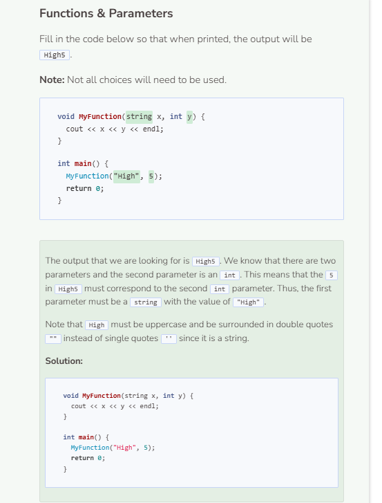

# Parameter Types
## Function with Different Parameters
In C++, you are allowed to define functions with the same name as long as the parameters are different in quantity or type.

```cpp
/**
* This function adds two integers together
*
* @param num1 The first integer
* @param num2 The second integer
*/
void Add(int num1, int num2) {
    cout << num1 + num2 << endl;
}

/**
* This function adds three integers together
*
* @param num1 The first integer
* @param num2 The second integer
* @param num3 The third integer
*/
void Add(int num1, int num2, int num3) {
    cout << num1 + num2 + num3 << endl;
}

int main() {
    Add(3, 14);
    return 0;
}
```

The two `Add()` functions above differ in the number of parameters they have. Here is an example of two functions with the same name but different parameter types.

```cpp
/**
* This function adds two integers together
*
* @param num1 The first integer
* @param num2 The second integer
*/
void Add(int num1, int num2) {
    cout << num1 + num2 << endl;
}

/**
* This function prints an integer followed
* by a string
*
* @param num1 The integer
* @param num2 The string
*/
void Add(int num1, string num2) {
    cout << num1 << num2 << endl;
}

int main() {
    Add(3, 14);
    return 0;
}
```

