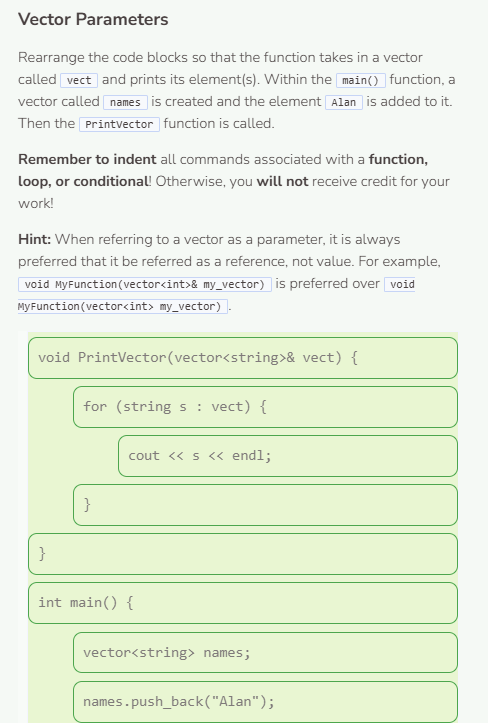
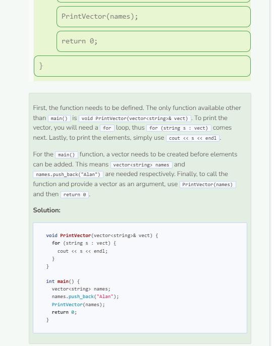

# Alternative Parameters
## Alternative Parameter Types
Function parameters do not necessarily need to belong to one of the four commonly used data types (`int`, `string`, `double`, `bool`). In fact, parameters can be arrays/vectors and even objects. For now, we will not focus on objects, which will be covered in a future module.

```cpp
/**
* This function prints all values of an array
*
* @param array A string array
*/
void PrintArray(string array[], int size) {
    for (int i = 0; i < size; i++) {
        cout << array[i] << endl;
    }
}

int main() {
    string names[] = {"Alan", "Bob", "Carol"};
    int len = sizeof(names) / sizeof(names[0]);
    PrintArray(names, len);
    return 0;
}
```

## Why Doesn’t the Code Below Work?
```cpp
/**
* This function prints all values of an array
*
* @param array A string array
*/
void PrintArray(string array[]) {
    for (int i = 0; i < sizeof(array) / sizeof(array[0]); i++) {
        cout << array[i] << endl;
    }
}

int main() {
    string names[] = {"Alan", "Bob", "Carol"};
    PrintArray(names);
    return 0;
}
```

When an array is passed as a function argument in C++, the system treats the array as a pointer that points to the first element within the array. Thus, the parameter `string array[]` is the same as `string* array`. Due to this, knowledge of the size of the array is lost. This is why it is a good practice to include an integer parameter for functions involving arrays so that the size can be calculated and stored before those functions are called.



