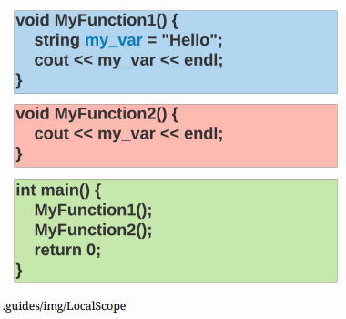
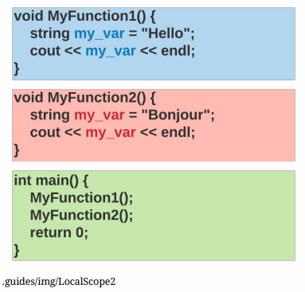
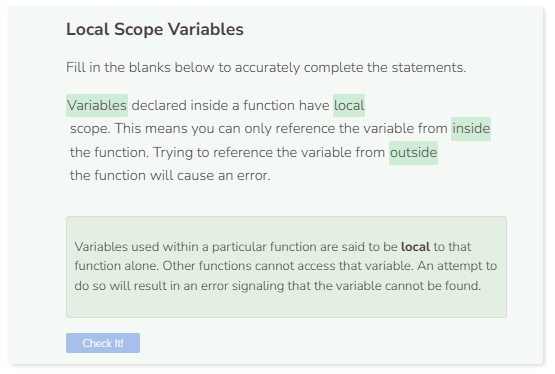

# Local Scope
## Local Scope
Take a look at the code below. The first function declares the variable `my_var` and then prints it. The second function also prints `my_var`. What do you think the output will be?

```cpp
void MyFunction1() {
    string my_var = "Hello";
    cout << my_var << endl;
}

void MyFunction2() {
    cout << my_var << endl;
}

int main() {
    MyFunction1();
    MyFunction2();
    return 0;
}
```

C++ returns an error such as error: `‘my_var’ was not declared in this scope` at the line containing `cout << my_var << endl;` within the second function. This happens because variables declared inside a function have local scope. Variables with local scope can only be used within that function. Outside of that function, those local variables cannot be accessed. In the image below, the light blue box represents the scope of `my_var`. Since `MyFunction2` (denoted in a light red box) is outside the scope of `my_var`, an error occurs.



## More Local Scope
Each function has its own local scope. That means you can declare two variables with the same name as long as they are in separate functions. The blue `my_var` exists only in the light blue box, and the red `my_var` exists only in the light red box. The boundaries of local scope keep C++ from overwriting the value of the first variable with the contents of the second.



```cpp
void MyFunction1() {
    string my_var = "Hello";
    cout << my_var << endl;
}

void MyFunction2() {
    string my_var = "Bonjour";
    cout << my_var << endl;
}

int main() {
    MyFunction1();
    MyFunction2();
    return 0;
}
```

