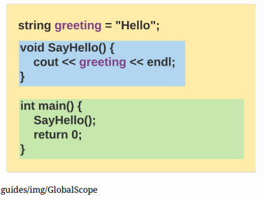
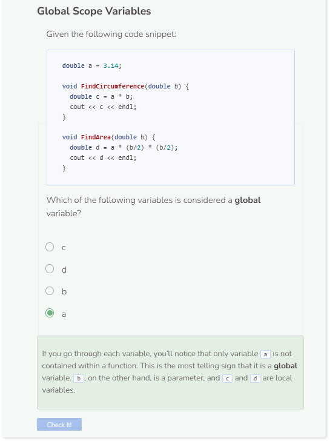

# Global Scope
## Global Scope - Referencing Variables
When a variable is declared inside a function, it has local scope. When a variable is declared outside of all existing functions, it has global scope. Since global variables are declared outside of functions, they can be referenced inside any function. Look at the image below. The yellow block holds everything within the program including the variable greeting. This enables all functions within the program to access that variable since it is considered to be global.



```cpp
string greeting = "Hello"; //global variable

void SayHello() {
    cout << greeting << endl; //can access global variable
}

int main() {
    SayHello();
    return 0;
}
```

## Global Scope - Modifying Variables
Once a global variable becomes available, a function can modify the content of that variable as needed.

```cpp
string greeting = "Hello";

void SayHello() {
    greeting = "Bonjour";
    cout << greeting << endl;
}

int main() {
    SayHello();
    return 0;
}
```

