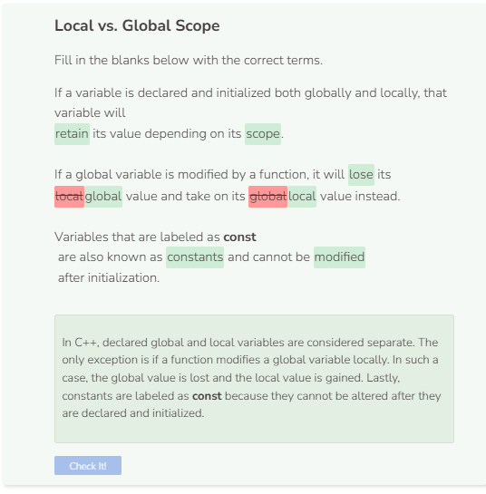

# Global vs. Local Scope
## Global vs. Local Scope
If a variable is declared and initialized both locally and globally, that variable will retain its content depending on how it is used. In the example
below, `my_var` is declared and initialized globally as global scope and locally as local scope. Since the variable has differing scopes, it retains its
value when called or printed.

```cpp
string my_var = "global scope";

void PrintScope() {
    string my_var = "local scope";
    cout << my_var << endl;
}

int main() {
    PrintScope();
    cout << my_var << endl;
}
```

The exception to this rule is when a function modifies a global variable. In such a case, the content of the global variable is changed.

```cpp
string my_var = "global scope";

void PrintScope() {
    my_var = "local scope";
    cout << my_var <<endl;
}

int main() {
    PrintScope();
    cout << my_var << endl;
}
```

When a global variable is also a function parameter, it is considered to be the same as if the function declared and initialized its own local variable. In this case, the variable has both a local and global scope and will retain its value depending on its scope.

```cpp
string my_var = "global scope";

void PrintScope(string my_var) {
    my_var = "local scope";
    cout << my_var << endl;
}

int main() {
    PrintScope(my_var);
    cout << my_var << endl;
}
```

## The “const” Keyword
If you want a global variable to remain unchanged throughout the program, you can declare the variable as `const`. `const` variables are also referred to as constants. Constants never change and are “named with a leading ‘k’ followed by mixed case. Underscores can be used as separators in the rare cases where capitalization cannot be used for separation.”

Source: [Google](https://google.github.io/styleguide/cppguide.html#Constant_Names)

Another common way to label constants is to use names in all uppercase with words separated by an underscore (_). For example: `MY_CONSTANT`.

```cpp
const string kMyConstant = "I NEVER CHANGE";

void PrintScope() {
    kMyConstant = "I CAN'T CHANGE";
    cout << kMyConstant << endl;
}

int main() {
    PrintScope();
    cout << kMyConstant << endl;
}
```


