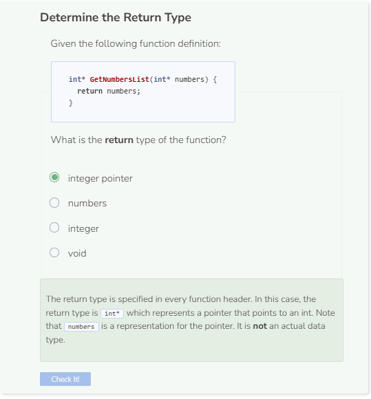

# Returning Values
## The Return Keyword
Instead of just printing data, functions can also return data. Think of the `sizeof()` and `length()` functions. They help return the size or length (in integer) of an array and string respectively. So the return value of these functions is of type int. Both `sizeof()` and `length()` do not print anything to the screen, they just return a number. From here on out, user-defined functions will avoid just printing to the screen. Instead, they will return a value. To return a value, simply use the return keyword.

```cpp
/**
* This function adds 5 to an integer
*
* @param num An integer
* @return The integer added to 5
*/
int AddFive(int num) {
    return num + 5;
}

int main() {
    AddFive(10);
    return 0;
}
```

You’ll notice the program no longer prints anything to the screen, which is the cause for the message, `Command was successfully executed.`. This happens because the function only adds 5 to whatever parameter is passed to the function and then returns it internally. To see the result, explicitly tell C++ to print the return value of the function to the screen.

```cpp
/**
* This function adds adds 5 to an integer
*
* @param num An integer
* @return The integer added to 5
*/
int AddFive(int num) {
    return num + 5;
}

int main() {
    int newNum = AddFive(10);
    cout << newNum << endl;
    return 0;
}
```

## Returning Values
Functions can return any value in C++ — ints, doubles, strings, vectors, etc

```cpp
/**
* This function adds two integers together
*
* @param x The first integer
* @param y The second integer
* @return x added to y
*/
int ReturnInt(int x, int y) { //int function
    return(x + y);
}

/**
* This function adds two doubles together
*
* @param x The first double
* @param y The second double
* @return x added to y
*/
double ReturnDouble(double x, double y) { //double function
    return(x + y);
}

/**
* This function adds two strings together
*
* @param x The first string
* @param y The second string
* @return x added to y
*/
string ReturnString(string x, string y) { //string function
    return(x + y);
}

int main() { //int function
cout << ReturnInt(1, 2) <<endl;
cout << ReturnDouble(1, 2) <<endl;
cout << ReturnString("1", "2") << endl;
return 0;
}
```

### Can you write a function that returns a vector?

If you want to return a vector, one possible approach is to have a vector be passed as a parameter. You can then modify the vector in some way, and then return it to the system.

The code below takes a vector of numbers as a parameter for the function `MultiplyFive()`. The function creates a new empty vector, multiplies each element of the parameter vector by 5, and then adds those new products to the new vector. Finally, the new vector is returned. To print the returned vector, use another enhanced for loop to iterate through the vector after it has been initialized.

```cpp
vector<int> MultiplyFive(vector<int>& my_list) {
    vector<int> new_list;
    for (auto a : my_list) {
        new_list.push_back(a * 5);
    }
    return new_list;
}
int main() {
    vector<int> numbers;
    numbers.push_back(1);
    numbers.push_back(2);
    numbers.push_back(3);
    numbers.push_back(4);
    numbers.push_back(5);
    vector<int> print_list = MultiplyFive(numbers);
    for (auto a : print_list) {
        cout << a << endl;
    }
return 0;
}
```

Alternatively, you can also type the function as void which results in fewer lines of code.

```cpp
void MultiplyFive(vector<int>& my_list) {
    vector<int> new_list;
    for (auto a : my_list) {
        new_list.push_back(a * 5);
    }
    for (auto a : new_list) {
        cout << a << endl;
    }
}
int main() {
    vector<int> numbers;
    numbers.push_back(1);
    numbers.push_back(2);
    numbers.push_back(3);
    numbers.push_back(4);
    numbers.push_back(5);
    MultiplyFive(numbers);
    return 0;
}
```



