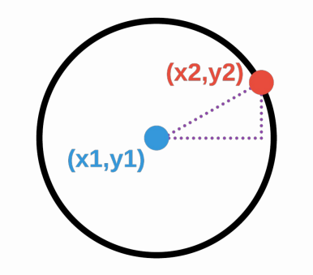
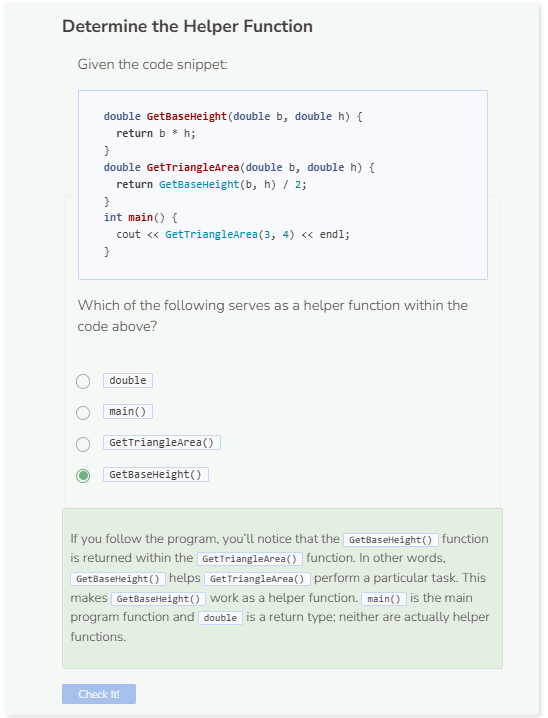

# Helper Functions
## Helper Functions
Helper functions are functions that are called from within other functions. Take, for example, the formula for calculating the area of a circle:

$$A = \pi * r^2$$

It would be quite easy to write a C++ function to calculate the area of a circle. However, instead of knowing the radius of the circle, you have the X/Y coordinates for a point at the center of the circle and another point on the circle. The distance formula (which is based on the Pythagorean Theorem) can calculate the radius of the circle.

$$\sqrt{(x2-x1)^2 + (y2-y1)^2}$$



The `FindRadius()` function uses the distance formula to calculate the distance between 2 pairs of points. The `FindArea()` function finds the area of a circle by relying on the `FindRadius()` function. Therefore, the `FindRadius()` function is a helper function. Helper functions help shorten how much code is needed to accomplish certain tasks.

```cpp
/**
* This function finds the radius of a circle given
* two coordinate points
*
* @param x1 A double of the first x-coordinate
* @param y1 A double of the first y-coordinate
* @param x2 A double of the second x-coordinate
* @param y2 A double of the second y-coordinate
* @return The radius of a circle in double
*/
double FindRadius(double x1, double y1, double x2, double y2) {
    return(sqrt(pow(x2 - x1, 2) + pow(y2 - y1, 2)));
}

/**
* This function finds the area of a circle given
* two coordinate points
*
* @param x1 A double of the first x-coordinate
* @param y1 A double of the first y-coordinate
* @param x2 A double of the second x-coordinate
* @param y2 A double of the second y-coordinate
* @return The area of a circle in double
*/
double FindArea(double x1, double y1, double x2, double y2) {
    return(M_PI * pow(FindRadius(x1, y1, x2, y2), 2));
}

int main() {
    cout << FindArea(0.0, 0.0, 4.0, 4.0) << endl;
    return 0;
}
```

### Math Functions
Note that in order to perform certain functions such as finding a square or an exponent, we need to `include <math.h>` in our header as well as to `define M_PI` which represents pi. If you remove these from the program header, the math functions associated with `<math.h>` will no longer work. In essence, these functions also serve as helper functions.

