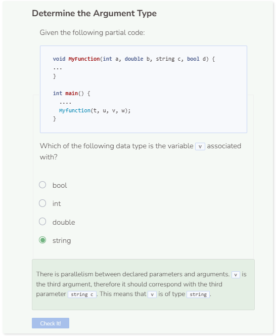

# Lab: Parameters
## The Slope Formula
You are going to write a function that takes in 4 doubles as parameters. These parameters represent two sets of coordinate points labeled as x1, y1, x2, and y2. The function will then use these points to calculate the slope that their line creates and then prints that slope to the user.

### Function Header
First, we need to set up the function header. As usual, we will start off with our return type. Since the result is simply printing the slope, we will use void as the return type. Additionally, we’ll name the function `GetSlope()`.

```cpp
void GetSlope() {
}
```

### Parameters
The function should take 4 doubles as parameters named x1, y1, x2, and y2.
```cpp
void GetSlope(double x1, double y1, double x2, double y2) {
}
```

### Printing the Slope
The final step is to print the slope, but we’ll need the slope formula in order to do that. The slope formula is defined as `(y2 - y1) / (x2 - x1)`.
```cpp
cout << (y2 - y1) / (x2 - x1) << endl;
```

### Testing the Function
In order to use a function, you’ll need to call it by specifying its name within the `main()` function. Note that the function requires parameters so we’ll need to provide some arguments in order for the function to work properly. Let’s use the points (3, 2) and (5, 6) as our coordinates which correspond to `(x1, y1)` and `(x2, y2)` respectively. Lastly, it is a best practice to include `return 0` as the last statement inside `main()`.

```cpp
int main() {
    GetSlope(3, 2, 5, 6);
    return 0;
}
```

The `GetSlope()` function will apply the slope formula `(6 - 2) / (5 - 3)` and print the result `2.0` to the user. Make sure to also include documentation so that other users can understand your function.

```cpp
/**
* This function prints the slope between two sets
* of coordinate points
*
* @param x1 A double of the first x-coordinate
* @param y1 A double of the first y-coordinate
* @param x2 A double of the second x-coordinate
* @param y2 A double of the second y-coordinate
* @return No return value
*/
void GetSlope(double x1, double y1, double x2, double y2) {
    cout << (y2 - y1) / (x2 - x1) << endl;
}

int main() {
    GetSlope(3, 2, 5, 6);
    return 0;
}
```



