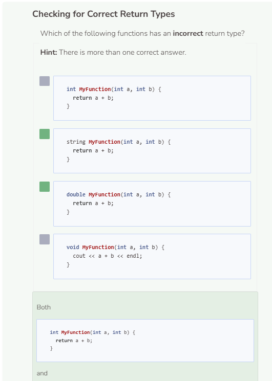
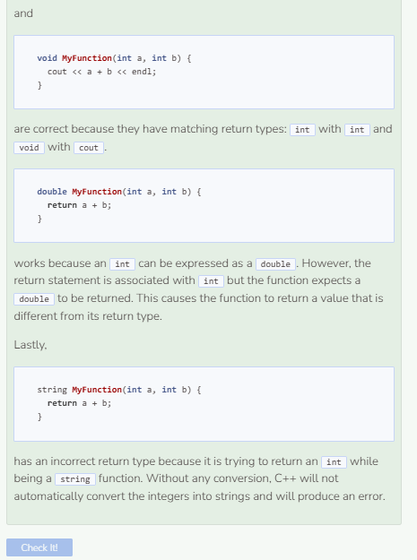

# Lab: Return Values
## Returning a Value
When the result of a function is simply a print statement, it is considered to be a `void` function. `void` functions do not have a return type, meaning they do not return data back to the user. To return data, use the keyword return followed by the data. Note that functions with return must be declared with same data type as the data that they return. For example, a function that returns an `double` must be declared in the header as a `double` function.

```cpp
double GetSlope(double x1, double y1,
                double x2, double y2) { //replace void with double
    double y_change = y2 - y1;
    double x_change = x2 - x1;
    return y_change / x_change; //returns a double
}
```

## Modifying the Return Value

Notice that our function returns a single double, which is nice but not extremely helpful when it comes to determining rise and run for slopes `(rise / run)`. Let’s say we want instead to express the slope in the `rise / run` format. rise is the change in y values and run is the change in x values. Unfortunately, we can’t simply do return `y_change + " / " + x_change`. Why? Because the `" / "` is a string which is not compatible with the current return value of double. One way around this is to convert the doubles into strings. Doing so will force us to change our double function into a string function.

```cpp
string GetSlope(double x1, double y1,
                double x2, double y2) { //replace double with string
    double y_change = y2 - y1;
    double x_change = x2 - x1;
    return to_string(y_change) + " / " + to_string(x_change);
    //returns a string
}
```

Notice how we need to use `to_string()` to convert our doubles into strings.

### Completing the Program
```cpp
double input1;
double input2;
double input3;
double input4;
/**
* This function returns the slope between two sets
* of coordinate points by calculating their coordinate
* changes separately
*
* @param x1 A double of the first x-coordinate
* @param y1 A double of the first y-coordinate
* @param x2 A double of the second x-coordinate
* @param y2 A double of the second y-coordinate
* @return A string expression of the slope in rise / run format
*/
string GetSlope(double x1, double y1,
    double x2, double y2) {
    double y_change = y2 - y1;
    double x_change = x2 - x1;
    return to_string(y_change) + " / " + to_string(x_change);
}
int main() {
    cout << "Enter first x coordinate: " << endl;
    cin >> input1;
    cout << "Enter first y coordinate: " << endl;
    cin >> input2;
    cout << "Enter second x coordinate: " << endl;
    cin >> input3;
    cout << "Enter second y coordinate: " << endl;
    cin >> input4;
    GetSlope(input1, input2, input3, input4);
}
```

### Printing the Slope
If we try to run the program, we will not see anything printed to the screen. Why? Because there is no print statement anywhere within the code. All the program does is calculate and return values. Returning values and printing them are not the same thing. Therefore, we need to include a print statement if we want to actually see the output. However, we cannot just include a print statement within our function because it is a string function, not a void one. Fortunately, we can use our `main()` function to print our desired output.

```cpp
double input1;
double input2;
double input3;
double input4;
/**
* This function returns the slope between two sets
* of coordinate points by calculating their coordinate
* changes separately
*
* @param x1 A double of the first x-coordinate
* @param y1 A double of the first y-coordinate
* @param x2 A double of the second x-coordinate
* @param y2 A double of the second y-coordinate
* @return A string expression of the slope in rise / run format
*/
string GetSlope(double x1, double y1,
    double x2, double y2) {
    double y_change = y2 - y1;
    double x_change = x2 - x1;
    return to_string(y_change) + " / " + to_string(x_change);
}

int main() {
    cout << "Enter first x coordinate: " << endl;
    cin >> input1;
    cout << "Enter first y coordinate: " << endl;
    cin >> input2;
    cout << "Enter second x coordinate: " << endl;
    cin >> input3;
    cout << "Enter second y coordinate: " << endl;
    cin >> input4;
    cout << GetSlope(input1, input2, input3, input4) << endl;
    //prints what is returned by the GetSlope() function
}
```


