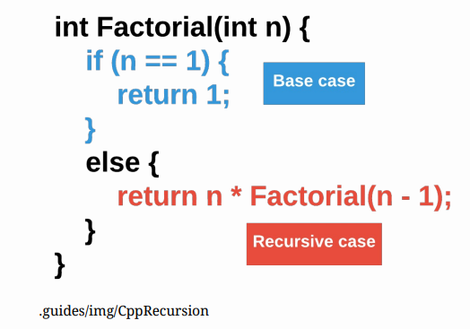

# What is Recursion
## What is Recursion?
Solving a coding problem with functions involves breaking down the problem into smaller problems. When these smaller problems are variations of the larger problem (also know as self-similar), then recursion can be used. For example, the mathematical function factorial is selfsimilar. Five factorial (5!) is calculated as 5 * 4 * 3 * 2 * 1. Mouse over the image below to see that 5! is really just 5 * 4!, and 4! is really just 4 * 3! and so on.

Because 5! is self-similar, recursion can be used to calculate the answer. Recursive functions are functions that call themselves.

```cpp
#include <iostream>
using namespace std;
//add function definitions below this line
/**
* Calculates factorial using recursion
*
* @param n, integer
* @return factorial of n, integer
*/
int Factorial(int n) {
    if (n == 1) {
        return 1;
    }
    else {
        return n * Factorial(n - 1);
    }
}

//add function definitions above this line
int main() {
    //add code below this line
    cout << Factorial(5) << endl;
    return 0;
    //add code above this line
}
```

Recursion is an abstract and difficult topic, so it might be a bit hard to follow what is going on here. When n is 5, C++ starts a multiplication problem of 5 * Factorial(4). The function runs again and the multiplication problem becomes 5 * 4 * Factorial(3). This continues until n is 1. C++ returns the value 1, and C++ solves the multiplication problem 5 * 4 * 3 * 2 * 1. The video below should help explain how 5! is calculated recursively.

## The Base Case
Each recursive function has two parts: the recursive case (where the function calls itself with a different parameter) and the base case (where the function stops calling itself and returns a value).



The base case is the most important part of a recursive function. Without it, the function will never stop calling itself. Like an infinite loop, C++ will stop the program with an error. Replace the function in your code with the one below and see what happens.

```cpp
/**
* This recursive function returns an error
*
* @param n, integer
* @return factorial of n, integer
*/
int Factorial(int n) {
    return n * Factorial(n - 1);
}
```

Always start with the base case when creating a recursive function. Each time the function is called recursively, the program should get one step closer to the base case.

