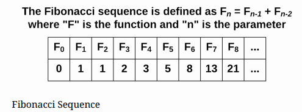
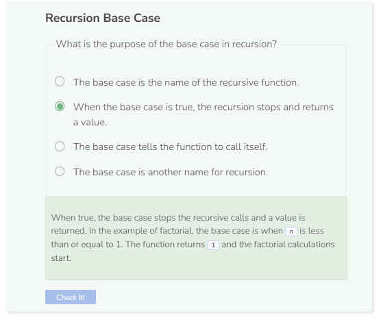

# Fibonacci Sequence
## Fibonacci Number
A Fibonacci number is a number in which the current number is the sum of the previous two Fibonacci numbers.



Calculating a Fibonacci number is self-similar, which means it can be defined with recursion. Setting the base case is important to avoid infinite recursion. When the number n is 0 the Fibonacci number is 0, and when n is 1 the Fibonacci number is 1. So if n is less than or equal to 1, then return n. That is the base case.

```cpp
/**
* @param n, integer
* @return Fibonacci number of n, integer
*/
int Fibonacci(int n) {
    if (n <= 1) {
        return n;
    }
    else {
        return(Fibonacci(n-1) + Fibonacci(n-2));
    }
}

int main() {
    cout << Fibonacci(3) << endl;
    return 0;
}
```

## Fibonacci Sequence
Fibonacci numbers are most often talked about as a sequence. The `main()` function below adds the functionality of printing a Fibonacci sequence of a predetermined length.

```cpp
int main() {
    int fibonacci_length = 4;
    for (int i = 0; i < fibonacci_length; i++) {
        cout << Fibonacci(i) << endl;
    }
    return 0;
}
```

### Why is C++ timing out?
The code written above is terribly inefficient. Each time through the loop, C++ is calculating the same Fibonacci numbers again and again. When i is 1, C++ calculates the Fibonacci numbers for 0 and 1. When i is 2, C++ is calculating the Fibonacci numbers for 0, 1, and 2. Once i becomes large enough, it becomes too much work for C++ to have to recalculate these large numbers over and over again. There is a more efficient way to do this by using vector. The idea is to store previously calculated Fibonacci numbers in the vector. So instead of recalculating the same numbers again and again, you can get these numbers from the vector. If a Fibonacci number is not in the vector, then calculate it and add it to the vector

`long` is a data type that can hold much larger values than `int` can. Thus, for larger numbers, `long` is necessary.

```cpp
long Fibonacci(long n) {
    static vector<long> v = {0, 1};
    if (n < v.size())
        return v.at(n);
    else {
        v.push_back(Fibonacci(n - 1) + Fibonacci(n - 2));
        return v.at(n);
    }
}

int main() {
    int fib_length = 50;
    for (int i = 0; i < fib_length; i++) {
        cout << Fibonacci(i) << endl;
    }
    return 0;
}
```

