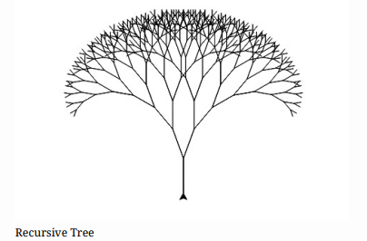

# Lab 1
## Lab 1 - Recursive Tree



Trees can be drawn recursively. Draw a branch. At the end of the branch, draw two smaller branches with one to the left and the other to the right. Repeat until a certain condition is true. This program will walk you through drawing a tree in this way.

## Turtle Graphics Review
We will be using Turtle Graphics to visualize recursion. Here is some review on what a Turtle object (tina) can do in C++:

- tina.forward(n) - Where n represents the number of pixels.
- tina.backward(n) - Where n represents the number of pixels.
- tina.right(d) - Where d represents the number of degrees.
- tina.left(d) - Where d represents the number of degrees.
- tina.pencolor({“COLOR”}) - Where COLOR represents the track or line color you want tina to leave behind.
- tina.width(W) - Where W represents how wide (in pixels) tina’s track is.
- tina.shape(“SHAPE”) - Where SHAPE represents the shape tina takes.
- tina.speed(SPEED) - Where SPEED represents how fast tina moves

|Command |Parameter |Examples|
|-|-|-|
|tina.pencolor({"COLOR"})| Where COLOR represents the track or line color you want tina to leave behind| red, orange, yellow, green, blue, purple|
|tina.width(W)| Where W represents how wide (in pixels) tina’s track is |any positive integer (e.g. 1, 10, 123, etc.)|
|tina.shape("SHAPE")| Where SHAPE represents the shape tina takes |triangle, indented triangle, square, arrow|
|tina.speed(SPEED)| Where SPEED represents how fast tina moves| TS_FASTEST, TS_FAST, TS_NORMAL, TS_SLOW, TS_SLOWEST|

## Program Instructions
Let’s start by creating a canvas screen and a Turtle object tina in `main()` to allow the Turtle object to move around on. Feel free to edit the screen size
so that it fits comfortably on your monitor. You’ll also notice that there is function called `RecursiveTree()`. This function takes three parameters, branch_length, angle, and t.

Note that when passing an object (like a Turtle), you should should pass it as a reference using the & symbol (i.e. Turtle& t).

```cpp
////////// DO NOT EDIT HEADER! //////////
#include <iostream> //
#include "CTurtle.hpp" //
#include "CImg.h" //
using namespace cturtle; //
using namespace std; //
/////////////////////////////////////////
/**
* @param branch_length An integer
* @param angle The angle of degree
* @param t A Turtle object
* @return A drawing symbolizing a tree branch
*/
void RecursiveTree(int branch_length, int angle, Turtle& t) {
    //add function definitions below
    //add function definitions above
}

int main(int argc, char** argv) {
    //add code below this line
    //add code above this line
    screen.exitonclick();
    return 0;
}
```

The base case for this function is a bit different. In previous examples, if the base case is true a value was returned. The function `RecursiveTree()` does not return a value, it draws on the screen instead. So the base case will be to keep recursing as long as branch_length is greater than some value. Define the base case as branch_length as being greater than 5.

```cpp
void RecursiveTree(int branch_length, int angle, Turtle& t) {
    //add function definitions below
    if (branch_length > 5) {
    }
    //add function definitions above
}
```

Start drawing the tree by going forward and turning right. Then call `RecursiveTree()` again, but reduce `branch_length` by 15. The code should run, but the tree will not look like a tree. It looks more like a curve made of a series of line segments decreasing in size.

```cpp
void RecursiveTree(int branch_length, int angle, Turtle& t) {
    //add function definitions below
    if (branch_length > 5) {
        t.forward(branch_length);
        t.right(angle);
        RecursiveTree(branch_length - 15, angle, t);
    }
    //add function definitions above
}
```

In `main()`, let’s call the `RecursiveTree()` function and pass in some initial values.

```cpp
int main(int argc, char** argv) {
    //add code below this line
    TurtleScreen screen(400, 300);
    Turtle tina(screen);
    RecursiveTree(45, 20, tina);
    //add code above this line
    screen.exitonclick();
    return 0;
}
```

The next step is to draw the branch that goes off to the left. Since the turtle turned to the right the number of degrees that the parameter angle represents, the turtle needs to turn to the left twice the degrees of angle. Turning to the left angle will put the turtle back at its original heading. The turtle needs to go further to the left. Then draw another branch whose length is reduced by 15.

```cpp
void RecursiveTree(int branch_length, int angle, Turtle& t) {
    //add function definitions below
    if (branch_length > 5) {
        t.forward(branch_length);
        t.right(angle);
        RecursiveTree(branch_length - 15, angle, t);
        t.left(angle * 2);
        RecursiveTree(branch_length - 15, angle, t);
    }
    //add function definitions above
}
```

The tree is looking better, but there are two more things that need to be done. First, put the turtle back to its original heading by turning right angle degrees. Then go backwards the length of the branch. If you tweak some of the arguments when calling the `RecursiveTree()` function, you might notice the tree changing.

```cpp
void RecursiveTree(int branch_length, int angle, Turtle& t) {
    //add function definitions below
    if (branch_length > 5) {
        t.forward(branch_length);
        t.right(angle);
        RecursiveTree(branch_length - 15, angle, t);
        t.left(angle * 2);
        RecursiveTree(branch_length - 15, angle, t);
        t.right(angle);
        t.backward(branch_length);
    }
    //add function definitions above
}
```
Code Sample
```cpp
////////// DO NOT EDIT HEADER! //////////
#include <iostream> //
#include "CTurtle.hpp" //
#include "CImg.h" //
using namespace cturtle; //
using namespace std; //
/////////////////////////////////////////
/**
* @param branch_length An integer
* @param angle The angle of degree
* @param t A Turtle object
* @return A drawing symbolizing a tree branch
*/
void RecursiveTree(int branch_length, int angle, Turtle& t) {
    //add function definitions below
    if (branch_length > 5) {
        t.forward(branch_length);
        t.right(angle);
        RecursiveTree(branch_length - 5, angle, t);
        t.left(angle * 2);
        RecursiveTree(branch_length - 5, angle, t);
        t.right(angle);
        t.backward(branch_length);
    }
    //add function definitions above
}

int main(int argc, char** argv) {
    //add code below this line
    TurtleScreen screen(400, 300);
    Turtle tina(screen);
    tina.left(90); //rotates Turtle's original position
    tina.speed(TS_FASTEST); //speeds up Turtle's movement
    RecursiveTree(35, 20, tina);
    //add code above this line
    screen.exitonclick();
    return 0;
}
```
