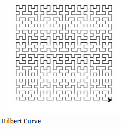

# Lab 2
## Lab 2 - The Hilbert Curve



The Hilbert Curve is a fractal, space-filling curve. Start by creating a Turtle object, and then write the function header for the recursive function Hilbert. The parameters for the function are the distance the turtle will travel, the rule to be used, an angle (determines how tight the fractal is), depth (how intricate the fractal is), and the Turtle object.

```cpp
////////// DO NOT EDIT HEADER! //////////
#include <iostream> //
#include "CTurtle.hpp" //
#include "CImg.h" //
using namespace cturtle; //
using namespace std; //
/////////////////////////////////////////
/**
* @param dist, integer
* @param rule, integer
* @param angle, integer
* @param depth, integer
* @param t, Turtle
* @return A drawing of the Hilbert Curve
*/
void Hilbert(int dist, int rule, int angle, int depth, Turtle&
t) {
    //add function definitions below
    //add function definitions above
}

int main(int argc, char** argv) {
    //add code below this line
    TurtleScreen screen(400, 300);
    Turtle tina(screen);
    //add code above this line
    screen.exitonclick();
    return 0;
}
```

The base case for the function is when depth is 0. Another way to think about the base case is that if depth is greater than 0, keep drawing the fractal. Use if (depth > 0) as the base case. Also, there are two rules for the turtle. Ask if rule is equal to 1 or if it is equal to 2.

```cpp
void Hilbert(int dist, int rule, int angle, int depth, Turtle&
t) {
//add function definitions below
if (depth > 0) {
    if (rule == 1) {
    //rule1 code
    }
    if (rule == 2) {
    //rule2 code
    }
}
//add function definitions above
}
```

The code continues with if rule is equal to 1, then the turtle is going to turn left, recursively call the `Hilbert()` function with rule set to 2, go forward, turn right, recursively call the `Hilbert()` function with rule set to 1, go forward, recursively call the `Hilbert()` function with rule set to 1, turn right, and finally move forward. Because the base case is based on depth, it must be reduced by 1 each time the `Hilbert()` function is called recursively.

```cpp
if (rule == 1) {
    //rule1 code
    t.left(angle);
    Hilbert(dist, 2, angle, depth - 1, t);
    t.forward(dist);
    t.right(angle);
    Hilbert(dist, 1, angle, depth - 1, t);
    t.forward(dist);
    Hilbert(dist, 1, angle, depth - 1, t);
    t.right(angle);
    t.forward(dist);
    Hilbert(dist, 2, angle, depth - 1, t);
    t.left(angle);
}
```

If rule is equal to 2, then the code is almost the inverse of when rule is equal to 1. The turtle will still go forward, but left turns become right turns, right turns become left turns, and recursive calls to Hilbert() will use 2 instead of 1 for the rule parameter (and vice versa)

```cpp
if (rule == 2) {
    //rule2 code
    t.right(angle);
    Hilbert(dist, 1, angle, depth - 1, t);
    t.forward(dist);
    t.left(angle);
    Hilbert(dist, 2, angle, depth - 1, t);
    t.forward(dist);
    Hilbert(dist, 2, angle, depth - 1, t);
    t.left(angle);
    t.forward(dist);
    Hilbert(dist, 1, angle, depth - 1, t);
    t.right(angle);
}
```

Finally, call the `Hilbert()` function in `main()` and run the program to see the fractal.

```cpp
int main(int argc, char** argv) {
    //add code below this line
    TurtleScreen screen(400, 300);
    Turtle tina(screen);
    Hilbert(5, 1, 90, 5, tina);
    //add code above this line
    screen.exitonclick();
    return 0;
}
```

The Hilbert Curve can be slow to draw. You can change the speed of the Turtle tina with the following command `tina.speed(TS_FASTEST);` before calling the `Hilbert()` function.

```cpp
////////// DO NOT EDIT HEADER! //////////
#include <iostream> //
#include "CTurtle.hpp" //
#include "CImg.h" //
using namespace cturtle; //
using namespace std; //
/////////////////////////////////////////
/**
* @param dist, integer
* @param rule, integer
* @param depth, integer
* @param t, Turtle
* @return A drawing of the Hilbert Curve
*/
void Hilbert(int dist, int rule, int angle, int depth, Turtle&
t) {
    //add function definitions below
    if (depth > 0) {
        if (rule == 1) {
        //rule1 code
        t.left(angle);
        Hilbert(dist, 2, angle, depth - 1, t);
        t.forward(dist);
        t.right(angle);
        Hilbert(dist, 1, angle, depth - 1, t);
        t.forward(dist);
        Hilbert(dist, 1, angle, depth - 1, t);
        t.right(angle);
        t.forward(dist);
        Hilbert(dist, 2, angle, depth - 1, t);
        t.left(angle);
        }
        if (rule == 2) {
        //rule2 code
        t.right(angle);
        Hilbert(dist, 1, angle, depth - 1, t);
        t.forward(dist);
        t.left(angle);
        Hilbert(dist, 2, angle, depth - 1, t);
        t.forward(dist);
        Hilbert(dist, 2, angle, depth - 1, t);
        t.left(angle);
        t.forward(dist);
        Hilbert(dist, 1, angle, depth - 1, t);
        t.right(angle);
        }
    }
    //add function definitions below
}
int main(int argc, char** argv) {
    //add code below this line
    TurtleScreen screen(400, 300);
    Turtle tina(screen);
    tina.speed(TS_FASTEST);
    Hilbert(8, 1, 90, 4, tina);
    //add code above this line
    screen.exitonclick();
    return 0;
}
```


