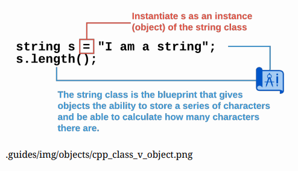
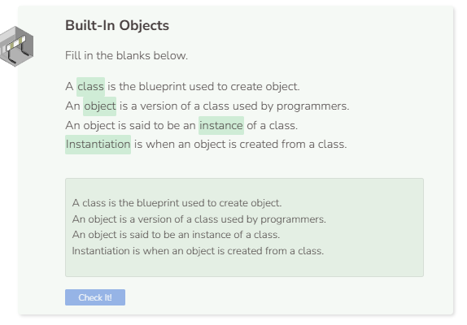

# Built-In Objects
## The String Object and Others
You have already been using built-in C++ objects. Strings are an example of a C++ object.

```cpp
string s = "I am a string";
cout << "s is a: " << typeid(s).name() << endl;
```

C++ says that the class or type of `s` is `NSt7__cxx1112basic_stringIcSt11char_traitsIcESaIcEEE` (which is a string). Replace the exiting code with the one below and run the program again.

```cpp
int arr[1];
cout << "arr is a: " << typeid(arr).name() << endl;
```

The resulting output says `arr is a: A1_i`. `A1` stands for one dimensional array and `i` stands for integer.

## Vocabulary
In the text above, the words “class” and “object” are used in an almost interchangeable manner. There are many similarities between classes and objects, but there is also an important difference. Working with objects has a lot of specialized vocabulary.

- **Classes** - Classes are a collection of data and the actions that can modify the data. Programming is a very abstract task. Classes were created to give users a mental model of how to think about data in a more concrete way. Classes act as the blueprint. They tell C++ what data is collected and how it can be modified.
- **Objects** - Objects are constructed according to the blueprint that is the class. In the code above, the variable `s` is a `string` object. It is not the class. The `string` class tells C++ that `s` has functions like `length`, `append`, and `replace`. When a programmer wants to use a class, they create an object. 
- **Instance** - Another way that programmers talk about objects is to say that an object is an instance of a particular class. For example, `s` is an instance of the `string` class.
- **Instantiation** - Instantiation is the process where an object is created according to a blueprint of the class. The phrase “define a variable” means to create a variable. The variable is given a name and a value. Once it has been defined, you can use the variable. With objects, you use the phrase “instantiate an object”. That means to create an object, give it a name, store any data, and define the actions the object can perform.




