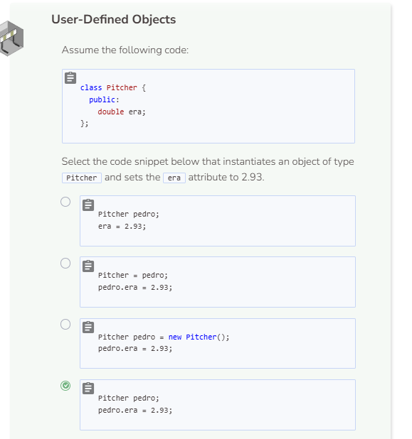
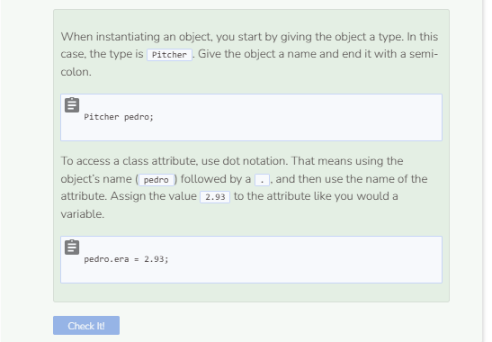

# User-Defined Objects
## Defining an Object
Assume you want to collect information about actors. Creating a class is a good way to keep this data organized. The `class` keyword is used to define a class. For now, do not add anything as the body of the class.

```cpp
//add class definitions below this line
class Actor {

};
//add class definitions above this line
```

### Naming classes
The convention for naming classes in C++ is to use a capital letter. A lowercase letter will not cause an error message, but it is not considered to be “correct”. If a class has a name with multiple words, all of the words are pushed together, and a capital letter is used for the first letter of each word. This is called camel case.

Classes are just the blueprint. To you use a class, you need to instantiate an object. Here is an object to represent Helen Mirren. Be sure to put this code in the `main` function.

```cpp
//add code below this line
Actor helen;
//add code above this line
```

So you now have `helen`, which is now an instance of the `Actor` class.

## Adding Attributes
The point of having a class is to collect information and define actions that can modify the data. The `Actor` class should contain things like the name of the actor, notable films, awards they have won, etc. These pieces of information related to a class are called attributes. Attributes are declared in the class itself. The  example below adds the `first_name` and `last_name` attributes which are both strings. Notice that a keyword is also required `public`. `public` is considered to be an access specifier which determines how accessible the attributes are from outside the class. Adding this keyword just means that the attributes `first_name` and `last_name` are readily accessible. For now, we will be using `public` as the access specifier for our classes.

```cpp
//add class definitions below this line
class Actor {
public:
    string first_name;
    string last_name;
};
//add class definitions above this line
```

You can change the value of an attribute with the assignment operator, `object_name.attribute = attribute_value`. Notice that you always use `object_name.attribute` to reference an attribute. This is called dot notation. Once an attribute has a value, you can treat it like any other variable. Add the following code to the `main` function. You are assigning values to the attributes `fist_name` and `last_name`, and then printing these values.

```cpp
//add code below this line
Actor helen;
helen.first_name = "Helen";
helen.last_name = "Mirren";
cout << helen.first_name + ' ' + helen.last_name << endl;
//add code above this line
```

Note that many objects in C++ cannot be printed directly, thus `cout << helen << endl;` resulted in an error. When printing objects, be sure to reference their attributes.


