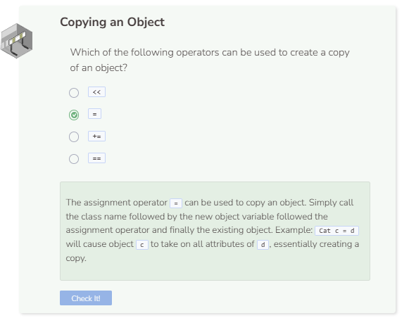

# Copying Objects
## Copying an Object
In C++, you can initialize a new object to an existing one to create a clone. What do you thin the code below does?

```cpp
//add class definitions below this line
class ComicBookCharacter {
    public:
        string name;
        int age;
        string type;
};

//add class definitions above this line
int main() {
    //add code below this line
    ComicBookCharacter a;
    a.name = "Calvin";
    a.age = 6;
    a.type = "human";
    ComicBookCharacter b = a;
    a.name = "Hobbes";
    cout << "Object a name: " << a.name << endl;
    cout << "Object a age: " << a.age << endl;
    cout << "Object a type: " << a.type << endl;
    cout << "Object b name: " << b.name << endl;
    cout << "Object b age: " << b.age << endl;
    cout << "Object b type: " << b.type << endl;
    //add code above this line
```

You’ll notice that the initializing one object to another created an exact copy of the original object. Each object is still treated as separate objects though so you can still freely change the attribute of one object without affecting another.


