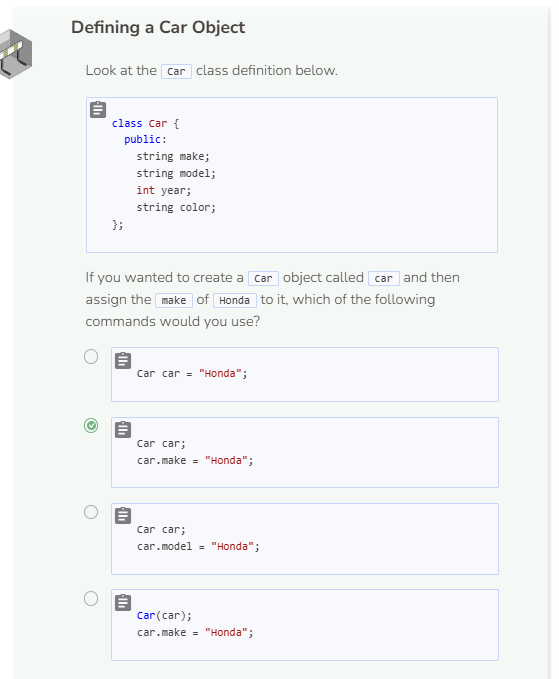
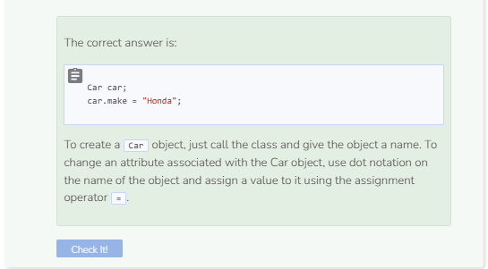

# Lab 1
## Lab 1: Defining Your Own Object
When defining an object, there are a few criteria that must be met in order for an object to be successfully created.

```cpp
class ClassName {
    public:
        type attribute1;
        type attribute2;
};
```
1. All objects are created inside `classes`. The first step is use the keyword `class`.
2. Give the class a name which is used to construct an object.
3. The keyword `public:` is needed in order to provide access to object attributes that you define later on.
4. Give your object as many attributes as needed in order to make full use of your object.
5. All attributes go within curly braces `{}` after the class name declaration. Make sure to end the closing curly brace with a semi-colon `;`.

## Student Object
Let’s define an object called `Student`. When we think of a student, some information or attributes that we might associate with students are:
* Name
* Student ID number
* Major
* GPA
* Age
* Year of graduation
Once we’ve narrowed down what attributes we want associated with our object, we can start defining them.

```cpp
class Student {
    public:
        string name;
        int ID;
        string major;
        double GPA;
        int age;
        int YOG;
};
```

## Creating the Object
Once the class has been established, we can create the object by calling on the object’s class and giving the object a name in the `main` function.

```cpp
Student andy;
andy.name = "Andy";
andy.ID = 123456;
andy.major = "Computer Science";
andy.GPA = 3.45;
andy.age = 22;
andy.YOG = 2021;
```

## Printing the Object’s Attributes
It is not sufficient to simply say `cout << andy;` in order to print the attributes associated with `andy`. Instead, we must use dot notation to specify what attribute of andy we want to output. To print andy’s ID for example, use `cout << andy.ID;`. Or to print andy’s major, use `cout << andy.major;`. 

```cpp
cout << andy.name << " is " << andy.age;
cout << " years old and is graduating with a degree in ";
cout << andy.major << " in " << andy.YOG << ".";
```


