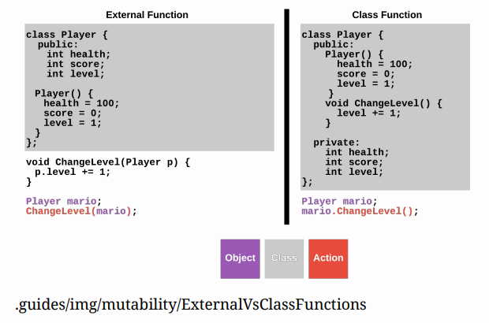

# External Functions vs. Class Functions
## Class Functions
Back in the Introduction to Objects module, a class was defined as “a collection of data and the actions that can modify the data.” The constructor can build the “collection of data”, but nothing in the class can modify the data. Instead, external functions were used to modify the object. However, using external functions to modify objects is not a good practice. Here, you will be introduced to class functions, also known as class or instance methods, that serve to modify the data within objects.

Think of a class function as a function that is attached to an object. The class function is the most common type of function when creating classes. Notice how class functions are declared inside of the class. These functions are called class functions because they have access to the class variables (the attributes declared in the constructor). Class functions are invoked using dot-notation.



There are a few notable differences between external functions and class functions.
1. In order for external functions to work, class variables within a class must be public. Otherwise, the function will not be able to act on the object. This, however, is not a good practice.
2. In C++, it is a best practice to make class variables private. Doing so prevents external functions from accidentally making undesirable changes to the class attributes. This is why class functions are preferred when modifying objects.
3. Everything within the class is public in the external function example. In contrast, class attributes are private while constructors and functions are public in the class function example.
4. To modify an object using an external function, the syntax is `Function(Object)` (i.e. `ChangeLevel(mario)`). On the other hand, the syntax for using a class function is `Object.Function()` (i.e. `mario.ChangeLevel()`).

## Converting to Class Functions
When mutability was first introduced, you made a `Player` class with a few external functions. You are now going to transform these external`functions into class functions moving forward. The `Player` class will be defined just as before. This time, however, `PrintPlayer` will be a part of the class.

```cpp
//add class definitions below this line
class Player {
    public: //public access modifer
        Player() { //constructor
            health = 100;
            score = 0;
            level = 1;
        }
    void PrintPlayer() { //class function
        if (health <= 0) {
            cout << "This player is dead. They died on level " << level;
            cout << " with a score of " << score << "." << endl;
        }
    else {
        cout << "This player has " << health << " health, a score of " << score;
        cout << ", and is on level " << level << "." << endl;
    }
}
    private: //private access modifiers
        int health;
        int score;
        int level;
};
//add class definitions above this line
```

In main, instantiate a `Player` object. Then call the class function `PrintPlayer` using dot-notation. Be sure to label the appropriate public and private access modifiers!

```cpp
//add code below this line
Player mario;
mario.PrintPlayer();
//add code above this line
```

## More Player Methods
The next class functions to add to the Player class are those to print the health and level attributes of the Player object. Start with the class function `ChangeHealth`. This function takes amount as an int parameter. `ChangeHealth` will add amount to the health attribute. If a player’s health increases, amount is positive. If their health decreases, amount is negative. Add `ChangeHealth` directly below `PrintPlayer()`.

```cpp
void PrintPlayer() { //class function
    if (health <= 0) {
        cout << "This player is dead. They died on level " << level;
        cout << " with a score of " << score << "." << endl;
    }
    else {
        cout << "This player has " << health << " health, a score of " << score;
        cout << ", and is on level " << level << "." << endl;
    }
}

void ChangeHealth(int amount) {
    health += amount;
}
```

The class function `NextLevel` is going to be similar to `ChangeHealth` except for one difference. `NextLevel` has no parameters. In video games, players go up in levels; rarely do they decrease. So the level attribute will increase by one when the class function `NextLevel` is called.

```cpp
void ChangeHealth(int amount) {
    health += amount;
}
void NextLevel() {
    level++;
}
```

Change `main` to:

```cpp
//add code below this line
Player mario;
mario.PrintPlayer();
mario.ChangeHealth(25);
mario.NextLevel();
mario.PrintPlayer();
//add code above this line
```

### Why learn about external functions that modify objects when C++ has class functions?
It might seem like a waste of time to learn how to write external functions that modify objects, but this approach builds upon concepts you have already seen — external functions and objects. This allows you to understand mutability without having to worry about class functions. Once you understand how these ideas work, transforming an external function into an class function is much simpler. External functions that modify objects serve as an intermediary step on the way to learning about class functions.
