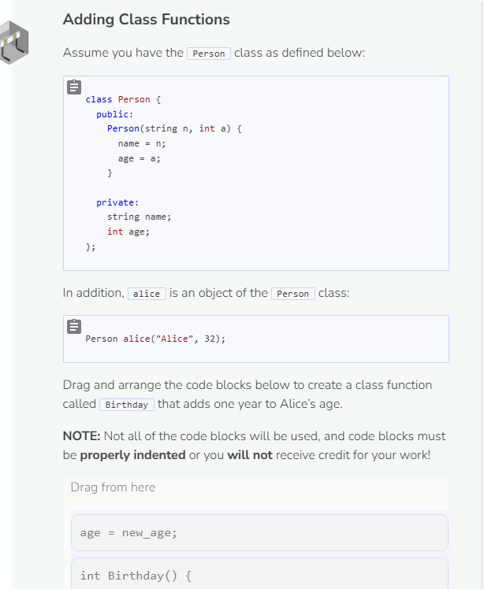
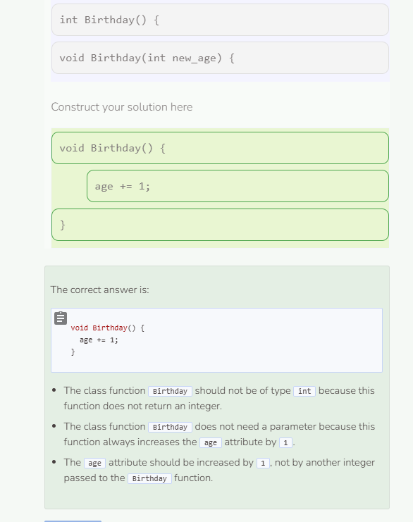

# More Class Functions
## More on Class Methods and Objects
Changes to objects should happen exclusively through class functions. This makes your code easier to organize and easier for others to understand. Imagine you are going to create a class that keeps track of a meal. In this case, a meal can be thought of as all of the drinks, appetizers, courses, and desserts served. Each one of these categories will become a class variable (attribute). Assign each attribute a vector of strings. Remember, class variables/attribute are `private`.

```cpp
//add class definitions below this line
class Meal {
    private:
        vector<string> drinks;
        vector<string> appetizers;
        vector<string> main_courses;
        vector<string> desserts;
};
//add class definitions above this line
```

Next, add a class function to add a drink to the `Meal` object. Use the `push_back` function to add an element to the vector. So `drinks.push_back(drink)` adds the drink `drink` to the vector `drinks`. Then add a class function `PrintDrinks` to print out all of the elements inside the drinks vector. Class functions are `public`.

```cpp
//add class definitions below this line
class Meal {
    public:
    void AddDrink(string drink) {
        drinks.push_back(drink);
    }
    void PrintDrinks() {
        for (auto a: drinks) {
        cout << a << endl;
    }
}
    private:
        vector<string> drinks;
        vector<string> appetizers;
        vector<string> main_courses;
        vector<string> desserts;
};
//add class definitions above this line
```

Create a `Meal` object in `main` and then test your code with the following added commands.

```cpp
//add code below this line
Meal dinner;
dinner.AddDrink("water");
dinner.PrintDrinks();
//add code above this line
```

Now create the `AddAppetizer` class function for the class. Like the `AddDrink` function above, `AddAppetizer` accepts a string as a parameter and adds it as an element to the appetizers attribute (which is a vector). Then create a `PrintAppetizers` function to print what’s inside the appetizers vector.

```cpp
void AddDrink(string drink) {
    drinks.push_back(drink);
}

void PrintDrinks() {
    for (auto a: drinks) {
        cout << a << endl;
    }
}

void AddAppetizer(string app) {
    appetizers.push_back(app);
}

void PrintAppetizers() {
    for (auto a: appetizers) {
        cout << a << endl;
    }
}
```

Add "`bruschetta`" as an appetizer to the dinner object, then call the class function `PrintAppetizers` like below.

```cpp
//add code below this line
Meal dinner;
dinner.AddDrink("water");
dinner.PrintDrinks();
dinner.AddAppetizer("bruschetta");
dinner.PrintAppetizers();
//add code above this line
```

```cpp
#include <iostream>
#include <vector>
using namespace std;
//add class definitions below this line
class Meal {
    public:
        void AddDrink(string drink) {
            drinks.push_back(drink);
        }
        void PrintDrinks() {
            for (auto a: drinks) {
                cout << a << endl;
            }
        }
        void AddAppetizer(string app) {
            appetizers.push_back(app);
        }
        void PrintAppetizers() {
            for (auto a: appetizers) {
                cout << a << endl;
            }
        }
        void AddMainCourse(string mc) {
            main_courses.push_back(mc);
        }
        void PrintMainCourses() {
            for (auto a: main_courses) {
                cout << a << endl;
            }
        }
        void AddDessert(string dessert) {
            desserts.push_back(dessert);
        }
        void PrintDesserts() {
            for (auto a: desserts) {
                cout << a << endl;
            }
        }
    private:
        vector<string> drinks;
        vector<string> appetizers;
        vector<string> main_courses;
        vector<string> desserts;
};
//add class definitions above this line
int main() {
    //add code below this line
    Meal dinner;
    dinner.AddDrink("water");
    dinner.PrintDrinks();
    dinner.AddAppetizer("bruschetta");
    dinner.PrintAppetizers();
    dinner.AddMainCourse("roast chicken");
    dinner.PrintMainCourses();
    dinner.AddDessert("chocolate cake");
    dinner.PrintDesserts();
    //add code above this line
    return 0;
}
```


