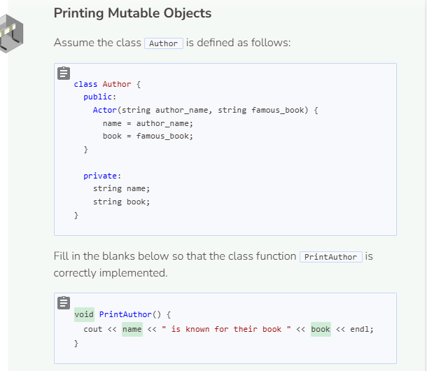
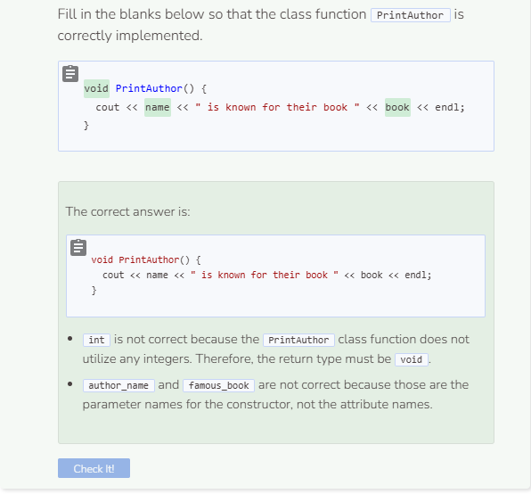

# Printing the Meal
## Format the Entire Meal

Current code

```cpp
#include <iostream>
#include <vector>
using namespace std;
//add class definitions below this line
class Meal {
    public:
        void AddDrink(string drink) {
            drinks.push_back(drink);
        }
        void PrintDrinks() {
            for (auto a: drinks) {
                cout << a << endl;
            }
        }
        void AddAppetizer(string app) {
            appetizers.push_back(app);
        }
        void PrintAppetizers() {
            for (auto a: appetizers) {
                cout << a << endl;
            }
        }
        void AddMainCourse(string mc) {
            main_courses.push_back(mc);
        }
        void PrintMainCourses() {
            for (auto a: main_courses) {
                cout << a << endl;
            }
        }
        void AddDessert(string dessert) {
            desserts.push_back(dessert);
        }
        void PrintDesserts() {
            for (auto a: desserts) {
                cout << a << endl;
            }
        }
    private:
        vector<string> drinks;
        vector<string> appetizers;
        vector<string> main_courses;
        vector<string> desserts;
};
//add class definitions above this line
int main() {
    //add code below this line
    Meal dinner;
    dinner.AddDrink("water");
    dinner.PrintDrinks();
    dinner.AddAppetizer("bruschetta");
    dinner.PrintAppetizers();
    dinner.AddMainCourse("roast chicken");
    dinner.PrintMainCourses();
    dinner.AddDessert("chocolate cake");
    dinner.PrintDesserts();
    //add code above this line
    return 0;
}
```

What you want to do next is to print all of the Meal attributes that you have in a format that is concise, clear, and makes sense. The ideal output should also take into consideration how many items there are. Here are some sample output:

0 Item in the Category
```
Drinks: None
```

1 Item in the Category
```
Drinks: water
```

2 Items in the Category
```
Drinks: water and lemonade
```

3 Items in the Category
```
Drinks: water, lemonade, and tea
```

## Modify the Class Functions
In order to print the desired results, you’ll have to modify the class functions. In particular, you’ll want to include multiple conditionals to select for the printing format that you want. Note that currently, an enhanced for loop is used to iterate the vectors. The first three sample output is more straightforward because you can just use the size function to check the vector’s size and then use the at function to print either 0, 1, or 2 items like below:

```cpp
void PrintDrinks() {
    if (drinks.size() == 0) {
        cout << "Drinks: None" << endl;
    }
    else if (drinks.size() == 1) {
        cout << "Drinks: " << drinks.at(0) << endl;
    }
    else if (drinks.size() == 2) {
        cout << "Drinks: " << drinks.at(0) << " and " << drinks.at(1) << endl;
    }
}
```

However, how will you select for categories that have 3 or more items? 

```cpp
void PrintDrinks() { //class definition
    if (drinks.size() == 0) {
        cout << "Drinks: None" << endl;
    }
    else if (drinks.size() == 1) {
        cout << "Drinks: " << drinks.at(0) << endl;
    }
    else if (drinks.size() == 2) {
        cout << "Drinks: " << drinks.at(0) << " and " << drinks.at(1) << endl;
    }
    else {
        cout << "Drinks: ";
        for (int i = 0; i < drinks.size() - 1; i++) {
            cout << drinks.at(i) << ", ";
        }
        cout << "and " << drinks.at(drinks.size() - 1) << endl;
    }
}
```

```cpp
Meal dinner;
dinner.PrintDrinks();
dinner.AddDrink("water");
dinner.PrintDrinks();
dinner.AddDrink("lemonade");
dinner.PrintDrinks();
dinner.AddDrink("tea");
dinner.PrintDrinks();
dinner.AddDrink("coffee");
dinner.PrintDrinks();
```

## Print the Entire Meal
Once you’ve completed modifying one class function. You can modify the rest as specified. To print the entire meal, create a class function called `PrintMeal` that incorporates all of the other Print functions. Once you’ve done that, test your code with the following statements in main:

```cpp
Meal dinner;
dinner.AddDrink("Pepsi");
dinner.AddDrink("Sprite");
dinner.AddAppetizer("egg rolls");
dinner.AddAppetizer("pot stickers");
dinner.AddAppetizer("buffalo wings");
dinner.AddMainCourse("smoked salmon");
dinner.PrintMeal();
```
Expected Output
```
Drink(s): Pepsi and Sprite
Appetizer(s): egg rolls, pot stickers, and buffalo wings
Main Course(s): smoked salmon
Dessert(s): None
```

```cpp
#include <iostream>
#include <vector>
using namespace std;
// add class definitions below this line
class Meal
{
public:
    void AddDrink(string drink)
    {
        drinks.push_back(drink);
    }
    void PrintDrinks()
    {
        if (drinks.size() == 0)
        {
            cout << "Drink(s): None" << endl;
        }
        else if (drinks.size() == 1)
        {
            cout << "Drink(s): " << drinks.at(0) << endl;
        }
        else if (drinks.size() == 2)
        {
            cout << "Drink(s): " << drinks.at(0) << " and " << drinks.at(1) << endl;
        }
        else
        {
            cout << "Drink(s): ";
            for (int i = 0; i < drinks.size() - 1; i++)
            {
                cout << drinks.at(i) << ", ";
            }
            cout << "and " << drinks.at(drinks.size() - 1) << endl;
        }
    }
    void AddAppetizer(string app)
    {
        appetizers.push_back(app);
    }
    void PrintAppetizers()
    {
        if (appetizers.size() == 0)
        {
            cout << "Appetizers(s): None" << endl;
        }
        else if (appetizers.size() == 1)
        {
            cout << "Appetizers(s): " << appetizers.at(0) << endl;
        }
        else if (appetizers.size() == 2)
        {
            cout << "Appetizers(s): " << appetizers.at(0) << " and "
                 << appetizers.at(1) << endl;
        }
        else
        {
            cout << "Appetizers(s): ";
            for (int i = 0; i < appetizers.size() - 1; i++)
            {
                cout << appetizers.at(i) << ", ";
            }
            cout << "and " << appetizers.at(appetizers.size() - 1)
                 << endl;
        }
    }
    void AddMainCourse(string mc)
    {
        main_courses.push_back(mc);
    }
    void PrintMainCourses()
    {
        if (main_courses.size() == 0)
        {
            cout << "Main Course(s): None" << endl;
        }
        else if (main_courses.size() == 1)
        {
            cout << "Main Course(s): " << main_courses.at(0) << endl;
        }
        else if (main_courses.size() == 2)
        {
            cout << "Main Course(s): " << main_courses.at(0) << " and " << main_courses.at(1) << endl;
        }
        else
        {
            cout << "Main Course(s): ";
            for (int i = 0; i < main_courses.size() - 1; i++)
            {
                cout << main_courses.at(i) << ", ";
            }
            cout << "and " << main_courses.at(main_courses.size() - 1) << endl;
        }
    }
    void AddDessert(string dessert)
    {
        desserts.push_back(dessert);
    }
    void PrintDesserts()
    {
        if (desserts.size() == 0)
        {
            cout << "Dessert(s): None" << endl;
        }
        else if (desserts.size() == 1)
        {
            cout << "Dessert(s): " << desserts.at(0) << endl;
        }
        else if (desserts.size() == 2)
        {
            cout << "Dessert(s): " << desserts.at(0) << " and " << desserts.at(1) << endl;
        }
        else
        {
            cout << "Dessert(s): ";
            for (int i = 0; i < desserts.size() - 1; i++)
            {
                cout << desserts.at(i) << ", ";
            }
            cout << "and " << desserts.at(desserts.size() - 1) << endl;
        }
    }
    void PrintMeal()
    {
        PrintDrinks();
        PrintAppetizers();
        PrintMainCourses();
        PrintDesserts();
    }

private:
    vector<string> drinks;
    vector<string> appetizers;
    vector<string> main_courses;
    vector<string> desserts;
};
// add class definitions above this line
int main()
{
    // add code below this line
    Meal dinner;
    dinner.AddDrink("Pepsi");
    dinner.AddDrink("Sprite");
    dinner.AddAppetizer("egg rolls");
    dinner.AddAppetizer("pot stickers");
    dinner.AddAppetizer("buffalo wings");
    dinner.AddMainCourse("smoked salmon");
    dinner.PrintMeal();
    // add code above this line
    return 0;
}
```


