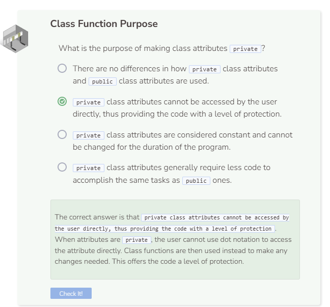

# Lab 2
## Lab 2
It is important to understand why class attributes are labeled as `private`. This provides a level of protection for your code since it does not allow the user to interact with the class attributes directly.

```cpp
//add class definitions below this line

class Student {
  public: 
    Student() {
      name;
      grade;
    }
  
  public:
    string name = "Alice";
    int grade = 4;
    int score = 65;
};

//add class definitions above this line
```
Because the code above has `public` class attributes, the following code in main can change those attributes’ values directly.

```cpp
  //add code below this line

  Student steve;
  steve.name = "Steve";
  cout << steve.name << endl;

  //add code above this line
```

However, if you change the class attributes from `public` to `private`, the code in main will no longer work.

```cpp
//add class definitions below this line

class Student {
  public:
    Student() {
      name;
      grade;
    }
  
  private:
    string name = "Alice";
    int grade = 4;
    int score = 65;
};

//add class definitions above this line
```

This is why understanding how class functions work is important. Class functions serve as the intermediate step between the objects and the class attributes. They are the ones interacting with the class attributes instead of the user.

```cpp
//add class definitions below this line

class Student {
  public:
    Student() {
      name;
      grade;
    }
    void ChangeName(string n) {
      name = n;
    }
    string ReturnName() {
      return name;
    }
  
  
  private:
    string name = "Alice";
    int grade = 4;
    int score = 65;
};

//add class definitions above this line
```

```cpp
  //add code below this line

  Student steve;
  steve.ChangeName("Steve");
  cout << steve.ReturnName() << endl;

  //add code above this line
```

Although using class functions may result in longer code, it prevents the user from seeing and interacting with the class attributes directly. This is why using class attributes is a best practice.

