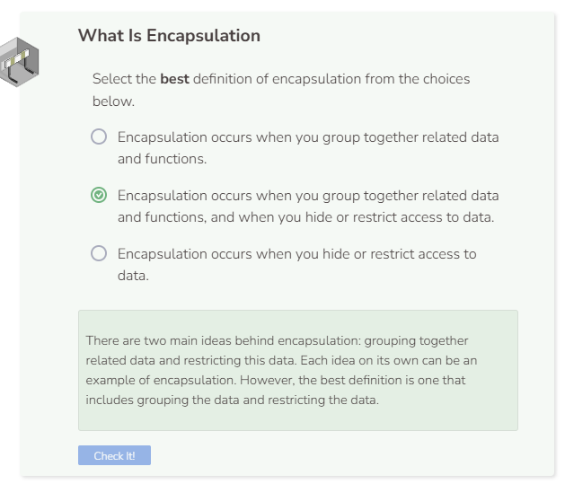

# What is Encapsulation?
## What is Encapsulation?
Encapsulation is a concept in which related data and methods are grouped together, and in which access to data is restricted. Grouping related data and functions makes thinking about your program a bit easier. Hiding or restricting how the user interacts with the data can keep the user from making unwanted changes.

The two main ideas of data restriction are the `public` and `private` keywords. These access modifiers (or keywords) can refer to classes, functions, and attributes. `public` means that the constructor, function, or attribute can be accessed both internally or externally. `private` means that the constructor, attribute, or function can only be accessed internally within the class itself.

## Classes as Encapsulation
Classes in C++ are a form of encapsulation; they group together related data and functions. In the code below, the attributes `num1` and `num2` are grouped together with the functions `Describe` and `Sum`. They are all a part of `ExampleClass`. The instance `my_example` is not a part of the class itself; it is considered to be separate.

```cpp
//add class definitions below this line

class ExampleClass {
    void SetN(int n1, int n2) {
      num1 = n1;
      num2 = n2;
    }
  
    void Describe() {
      cout << "My numbers are: " << num1 << " and " << num2 << endl;
    }
  
    int Sum() {
      return num1 + num2;
    }
  
    int num1;
    int num2;
};

//add class definitions above this line
```

```cpp
  //add code below this line
  
  ExampleClass my_example;
  my_example.SetN(5, 7);
  my_example.Describe();
  cout << my_example.Sum() << endl;

  //add code above this line
```

The code above results in an error, but we’ll find out why next.

## Hiding Data
You’ve learned in the Mutability chapter that class functions are typically public and attributes are typically private. The `public` access modifier enables other classes to have access to those functions. On the other hand, the `private` access modifier disables access to attributes to prevent users from imposing unwanted changes. Moving forward, we’ll abide by the access modifier rules within the chart below.

|Category|	Public|	Private|
|-|-|-|
|Constructor|	X|	|
|Functions|	X|	X|
|Attributes|	|	X|

### Why are functions both public and private?
In the pages that follow, you will see when making functions public is a good idea, and when keeping functions private is preferable. A well designed program will use a mix of public and private functions. Previously, we've learned that helper functions can be kept private since they are not directly accessed externally.

This is the same `ExampleClass` from above. It now uses the `public` and `private` access modifiers to hide the data or to make them accessible.

```cpp
//add class definitions below this line

class ExampleClass {
  public:
    void SetN(int n1, int n2) {
      num1 = n1;
      num2 = n2;
    }
  
    void Describe() {
      cout << "My numbers are: " << num1 << " and " << num2 << endl;
    }
  
    int Sum() {
      return num1 + num2;
    }
  
  private:
    int num1;
    int num2;
};

//add class definitions above this line
```

Note that when no access modifier is specified within a class, that attribute, function, or constructor is automatically declared as `private` by default. To make them public, you must specify `public` in the code.

Your code should run fine now because the instance or object is only interacting with `public` information. Now try to print the values for the `num1` and `num2` attributes.

```cpp
  //add code below this line
  
  ExampleClass my_example;
  my_example.SetN(5, 7);
  cout << my_example.num1 << endl;
  cout << my_example.num2 << endl;

  //add code above this line
```

C++ produces an error message because an instance cannot directly access a `private` attribute. This is an example of hiding data. `my_example` cannot print `num1` or num`2 because they are `private`. However, `my_example` can access the public methods, which can then access the private attributes.


