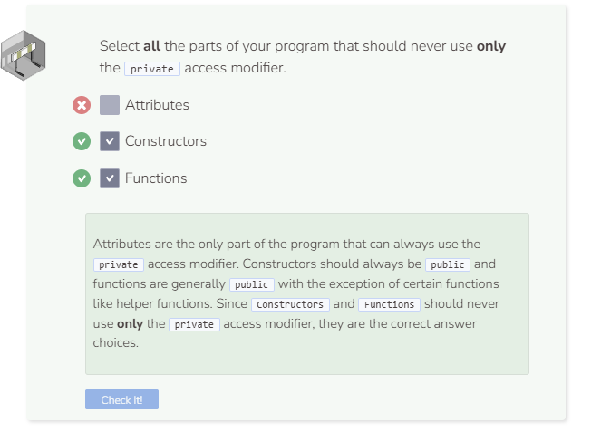

# Public Access Modifier
## Public Attributes
While C++ allows you to make instance attributes `public`, this is not encouraged. In fact, encapsulation asks that all attributes remain `private`. C++ itself, however, allows for public attributes. The following class has three attributes and all of them are public.

```cpp
//add class definitions below this line
    
class Phone {
  public:
    Phone(string mo, int st, int me) {
      model = mo;
      storage = st;
      megapixels = me;
    }
  
    string model;
    int storage;
    int megapixels;
};

//add class definitions above this line
```

Instantiate a `Phone` object and manipulate the different attributes.

```cpp
  //add code below this line
  
  Phone my_phone("iPhone", 256, 12);
  cout << my_phone.model << endl;
  my_phone.storage = 64;
  cout << my_phone.storage << endl;
  cout << my_phone.megapixels + 10 << endl;

  //add code above this line
```

When an attribute is public, a user can do whatever they want to it. This can become problematic. In the code above, the phone’s storage was reduced by 75%. This should not happen. Encapsulation limits what and how information is modified. By hiding data, you can ensure that users only manipulate the class in an approved manner.

## Public Functions
Since all attributes should be private, we will use this access modifier for the following code sample. Unlike attributes, you are encouraged to have public functions. If all of your functions are private, it would be impossible to interact with the object. The constructor is a special kind of function, and this too should be public.

```cpp
//add class definitions below this line
    
class Phone {
  public:
    Phone(string mo, int st, int me) {
      model = mo;
      storage = st;
      megapixels = me;
    }
  
  private:
    string model;
    int storage;
    int megapixels;
};
  
//add class definitions above this line
```
The real benefit of a public function is that it can access private attributes. Public functions are the gateway to dealing with private data. Create the public function `Describe` that prints a description of the Phone object.

```cpp
//add class definitions below this line
    
class Phone {
  public:
    Phone(string mo, int st, int me) {
      model = mo;
      storage = st;
      megapixels = me;
    }
  
    void Describe() {
      cout << "My " << storage << " gig " << model;
      cout << " has a " << megapixels << " megapixels camera." << endl;
    }
  
  private:
    string model;
    int storage;
    int megapixels;
};

//add class definitions above this line
```
Instantiate a `Phone` object and call the `describe` method.

```cpp
  //add code below this line
  
  Phone my_phone("iPhone", 256, 12);
  my_phone.Describe();

  //add code above this line
```
The constructor is a special kind of function that is called when an object is created. Once the constructor is private, it cannot be called outside the class. That is why C++ throws an error message. The only way a private constructor can work is if a class is declared inside another class. The outer class can call the inner constructor even if it is private.


