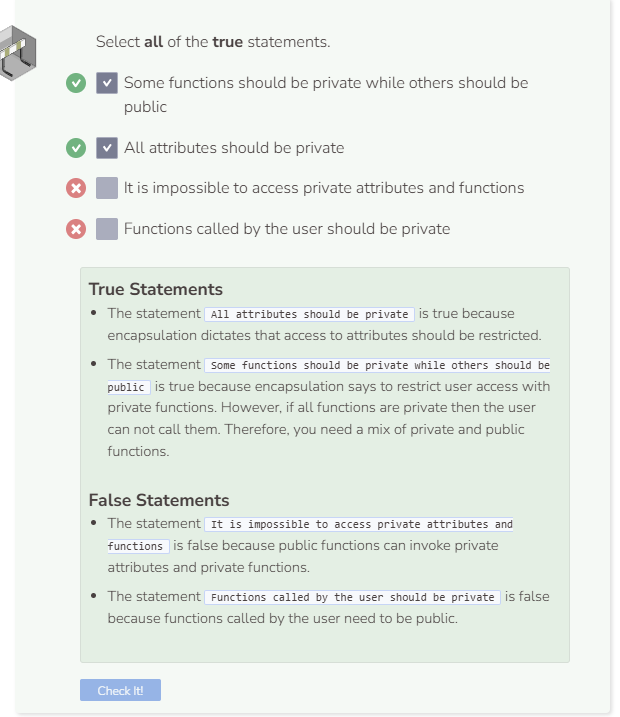

# Private Access Modifier
As discussed on the previous page, we will be making all attributes private. Instance attributes, static attributes, constants — it does not matter, they will all be private.

## Private Functions
Functions too, can be private. And just like private attributes, private functions are accessed by public functions. Here is an example class with a private function.

```cpp
//add class definitions below this line

class PrivateExample {
  public:
    PrivateExample(int n) {
      num = n;
    }
  
    void PublicFunction() {
      PrivateFunction();
    }
  
  private:
    int num;
  
    void PrivateFunction() {
      cout << "The double of " << num << " is: " << num * 2 << endl;
      cout << num << " squared is: " << num * num << endl;
    }
};

//add class definitions above this line
```

Instantiate an object and try to call `PrivateFunction`.

```cpp
  //add code below this line
  
  PrivateExample my_example(5);
  my_example.PrivateFunction();

  //add code above this line
```

C++ throws an error message because an instance cannot directly access a private function. Change the function call to `PublicMethod` and run the code again. This time it should work because public functions can access private functions and/or attributes.

```cpp
  //add code below this line
  
  PrivateExample my_example(5);
  my_example.PublicFunction();

  //add code above this line
```

## Public and Private Methods
A well written C++ program will make use of both public and private functions. Deciding what to make public and what to make private comes down to how you want the user to interact with your code. Only make public those functions you want the user to call. Keep everything else private. The example below is a class that counts the number of vowels in a strings.

First let’s add the private functions and attributes. Note that the `IsVowel` and `CountVowels` functions will serve as helper functions in a later function. This is why they do not need to be accessed directly by the user and should be `private`.

```cpp
//add class definitions below this line

class Words {
  private:
    string word;
    int count;
  
    bool IsVowel(char ch) {
      ch = toupper(ch);
      return (ch=='A' || ch=='E' || ch=='I' ||
              ch=='O' || ch=='U');
    }
  
    int CountVowels(string str, int n) {
      if (n == 1) {
        return IsVowel(str[n-1]);
      }
      return CountVowels(str, n-1) + IsVowel(str[n-1]);
    }
};

//add class definitions above this line
```
Next, add the `public` components such as the constructor `Words`. The constructor instantiates an object with the `word` and `count` attributes. The other public component is the `Printer` function, which calls the `IsVowel` and `CountVowels` functions. Without this public `Printer` function, `IsVowel` and `CountVowels` will be completely inaccessible.

```cpp
//add class definitions below this line

class Words {
  public:
    Words(string str, int n) {
      word = str;
      count = n;
    }

    void Printer() {
      cout << "The number of vowels in " << word;
      cout << " is " << CountVowels(word, count) << endl;
    }

  private:
    string word;
    int count;
  
    bool IsVowel(char ch) {
      ch = toupper(ch);
      return (ch=='A' || ch=='E' || ch=='I' ||
              ch=='O' || ch=='U');
    }
  
    int CountVowels(string str, int n) {
      if (n == 1) {
        return IsVowel(str[n-1]);
      }
      return CountVowels(str, n-1) + IsVowel(str[n-1]);
    }
};

//add class definitions above this line
```
Finally, instantiate a `string` to use as an argument and a `Words` object in order to run the function `Printer` and see the program output.

```cpp
  //add code below this line
  
  string s = "house";
  Words vowels(s, s.length());
  vowels.Printer();

  //add code above this line
```


