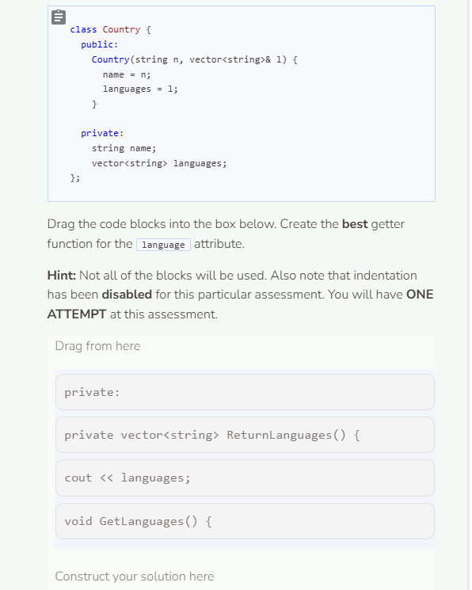
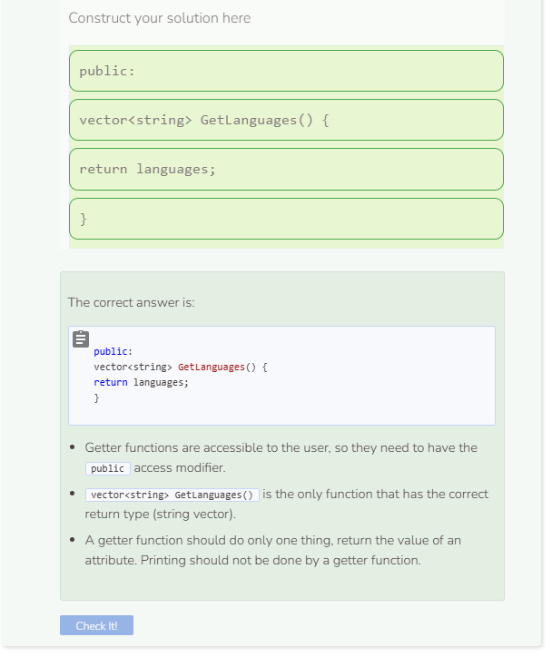

# Getters
## Getters
While all attributes are private, that does not mean that the user will not need to access the values of these attributes. A public function can be used to access a private attribute. This type of function has a special name, a getter (also called an accessor). The whole purpose of a getter is to return an attribute. These functions get their name because they always start with Get followed by the attribute name.

```cpp
//add class definitions below this line
    
class Phone {
  public:
    Phone(string mo, int s, int me) {
      model = mo;
      storage = s;
      megapixels = me;
    }

    string GetModel() {
      return model;
    }
  
  private:
    string model;
    int storage;
    int megapixels;
};
  
//add class definitions above this line
```
The function `GetModel` is an example of a getter. Getters are very simple, straightforward functions that do only one thing — return a private attribute. Getters can be treated just as you would treat the attribute (except for changing its value). To test a getter, you can call in `main` to see if it returns what is expected.

```cpp
  //add code below this line

  Phone my_phone("iPhone", 256, 12);
  cout << my_phone.GetModel() << endl;

  //add code above this line
```

## Benefits of Getters
Using a getter is the same thing as accessing a public attribute. Why not make the attribute public? That would mean writing less code. Is that not a good thing? A public attribute makes no distinction between accessing its value and changing its value. If you can access it, you can change it (or vice versa). Using a getter with a private attribute makes this distinction clear; you can access the value, but you cannot change it.

```cpp
  //add code below this line

  Phone my_phone("iPhone", 256, 12);
  cout << my_phone.GetModel() << endl;
  my_phone.model = "Pixel 5";

  //add code above this line
```
The code above generates an error because an instance cannot alter a private attribute. Using a getter allows limited access to an attribute, which is preferable to the full access a public access modifier allows.


