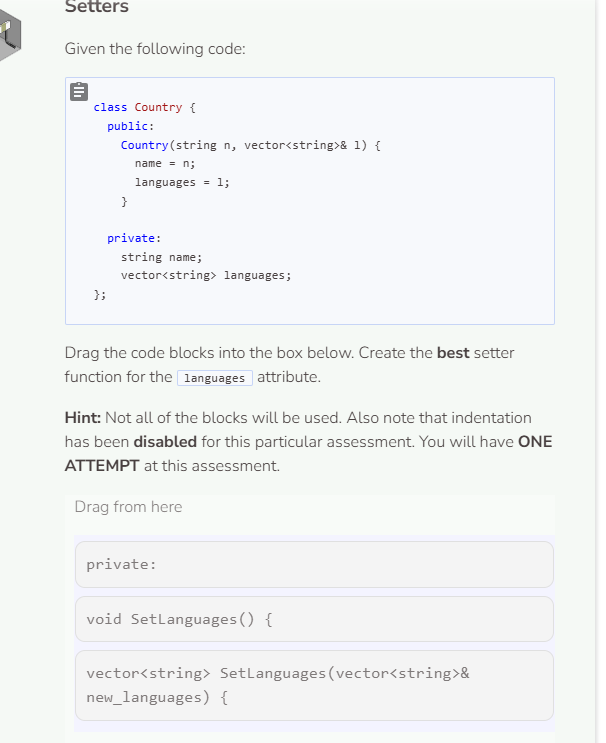
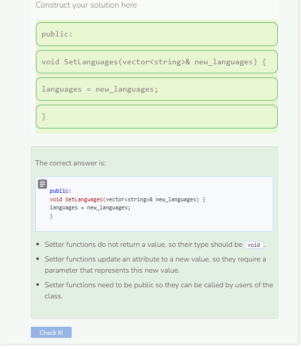

# Setters
## Setters
Setters are the compliment to getters in that they allow you to set the value of a private attribute. Setter functions are also called mutators. Use the `Phone` class from the previous page.

```cpp
//add class definitions below this line
    
class Phone {
  public:
    Phone(string mo, int s, int me) {
      model = mo;
      storage = s;
      megapixels = me;
    }

    string GetModel() {
      return model;
    }

    int GetStorage() {
      return storage;
    }

    int GetMegapixels() {
      return megapixels;
    }
  
  private:
    string model;
    int storage;
    int megapixels;
};
  
//add class definitions above this line
```

Add the `SetModel` method to the `Phone` class. As this is a setter method, start the name with `Set` followed by the name of the attribute. Setters do not return anything. Finally, setters have a parameter — the new value for the attribute.

```cpp
  public:
    // Setter
    void SetModel(string new_model) {
      model = new_model;
    }
```

Now that you are implementing both getters and setters, you should now be able to access and modify private attributes.

```cpp
  //add code below this line

  Phone my_phone("iPhone", 256, 12); 
  cout << my_phone.GetModel() << endl;
  my_phone.SetModel("XR");
  cout << my_phone.GetModel() << endl;
  
  //add code above this line
```

## Comparing Getters and Setters
Getters and setters have a lot in common. Their names are similar, they have the same number of lines of code, etc. However, getters and setters also differ in a few important ways. The table below highlights these similarities and differences.

|Category|	Getters|	Setters|
|-|-|-|
|Has public keyword|	X|	X|
|Has private keyword|	-|	-|
|Has return statement|	X|	-|
|Has void type|	-|	X|
|Performs only 1 task|	X|	X|
|Has parameter|	-|	X|



