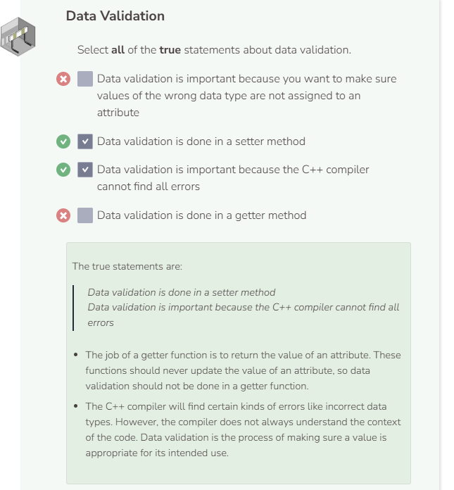

# Data Validation
C++ already has a type system which will flag errors when a boolean value is passed to a function that takes an integer. However, just because a function takes an integer does not mean that all integers are valid for that function. Data validation is the process of asking if this data is appropriate for its intended use. Take a look at the `Person` class.

```cpp
//add class definitions below this line
    
class Person {
  public :
    Person(string n, int a) {
      name = n;
      age = a;
    }

    string GetName() {
      return name;
    }

     void SetName(string new_name) {
      name = new_name;
    }

     int GetAge() {
      return age;
    }

     void SetAge(int new_age) {
      age = new_age;
    }
  
  private: 
    string name;
    int age;
};
  
//add class definitions above this line
```

The `SetAge` function will assign any value to the attribute `age` as long as the value is an integer. There are some integers which make no sense when thought of as an age attribute. The code sample below sets the age of `my_person` to `-100`. `-100` is a valid integer, but it is not a valid age. This is why data validation is important. C++’s compiler is not sufficient to catch all errors.

```cpp
  //add code below this line

  Person my_person("Calvin", 6);
  cout << my_person.GetName() << " is " << my_person.GetAge() << " years old." << endl;
  my_person.SetAge(-100);
  cout << my_person.GetName() << " is " << my_person.GetAge() << " years old." << endl;

  //add code above this line
```

Another benefit of using setters is that data validation can take place before the new value is assigned to the attribute. Modify `SetAge` so that it will only update the `age` attribute if the new value is greater than or equal to `0`. This way you can ensure that the `Person` object always has a valid age.

```cpp
  void SetAge(int new_age) {
    if (new_age >= 0) {
      age = new_age;
    }
  }
```




