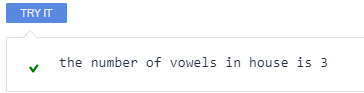

# Encapsulation Lab 1
This lab will focus on building on the idea of a “black box.” The term “black box” is used to describe a system in which the internal workings are hidden from the user. In fact, the user is not expected to know how the system works; they only need to know how to use it. Encapsulation allows you to create classes that are black boxes. Previously, we created a class `Words` that took in a string and printed the number of vowels in that string.



In this lab, we are going to create a function that gives the user the ability to put in a vector of strings and our program will print out the number of vowels in each string within that vector.

```cpp
  //add code below this line

    vector<string> list = {"house", "cake", "pancake"};
    Words vowels(list);
    vowels.CoutStrings();

  //add code above this line
```

If you run the code above successfully in `main`, you should expect to see `3,2,3` as the output.

In this scenario, we are going to modify our previous `Words` class so that it can include a vector. All of the following code will go into the `class definitions` field.

```cpp
class Words {
  private:
    vector<string> list_of_words;
};
```
We don’t need to reinvent the wheel; we previously worked on a few functions that told us how many vowels exist in a specific string. We are going to again re-use those functions. These are functions that the user does not need to interact with. Thus, they can be `private`, essentially making them act as part of the “black box.” Now, add the following `private` functions into the `Words` class.

```cpp
bool IsVowel(char ch) {
  ch = toupper(ch);
  return (ch=='A' || ch=='E' || ch=='I' ||
          ch=='O' || ch=='U');
}

int CountVowels(string str, int n) {
  if (n == 1) {
    return IsVowel(str[n-1]);
  }
  return CountVowels(str, n-1) + IsVowel(str[n-1]);
}
```

Now that all of the data that we don’t want the user to manipulate are properly encapsulated as `private`, we can start working on our `public` members such as the constructor `Words` and the function `CoutStrings`. In the example above, we can see our constructor takes in one attribute.

```cpp
public:
  Words(vector<string>& n){
    list_of_words = n;
  }
```

Another piece of information that we have from the main function is that the function `CoutStrings` is used. This function has no arguments, but is accessible to the user. This function also has several other tasks:
1. It iterates through a given vector
2. Counts the number of vowels in each given string
3. Creates a vector storing the vowel sizes
4. Prints out the output in a defined fashion

```cpp
void CoutStrings() {
   vector<int> vowel_sizes;
   int size;
   for (auto a : list_of_words) {
     size = CountVowels(a, a.length());
     vowel_sizes.push_back(size);
   }
   for (int i = 0; i < vowel_sizes.size(); i++) {
     if (i == vowel_sizes.size()-1) {
       cout << vowel_sizes.at(i) << endl;
     }
     else {
       cout << vowel_sizes.at(i) << ',';
     }
   }
 }
```

