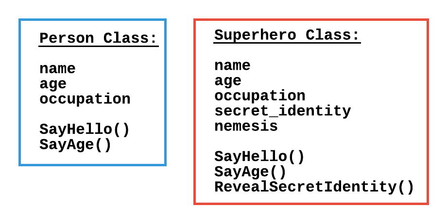
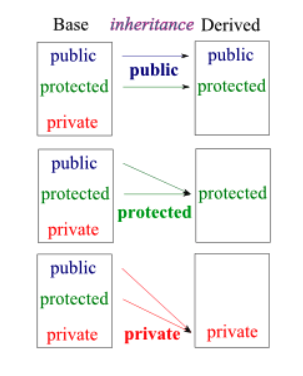
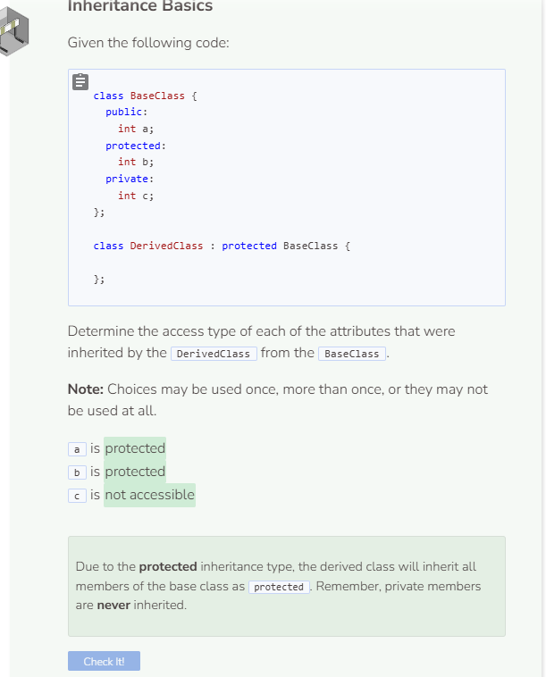

# What is Inheritance?
## Defining Inheritance
Imagine you want to create two C++ classes, `Person` and `Superhero`. These respective classes might look something like this:



There are some similarities between the `Person` class and the `Superhero` class. If the `Person` class already exists, it would be helpful to “borrow” from the `Person` class so you only have to create the new attributes and functions for the `Superhero` class. This situation describes inheritance — one class copies the attributes and functions from another class.

## Inheritance Syntax
In the IDE on the left, the `Person` class is already defined. To create the `Superhero` class that inherits from the `Person` class, add the following code at the end of the class definitions. Notice how the `Superhero` class definition contains a colon `:` followed by `public` and then `Person`. This is how you indicate to C++ that the `Superhero` class inherits from the `Person` class. You can also say that `Person` is the base class and `Superhero` is the derived class. A base class in C++ is also referred to as a **superclass** or **parent** class while a derived class is also referred to as a **subclass** or **child** class. All of these terms can be used interchangeably.

```cpp
//add class definitions below this line

class Superhero : public Person {
  
};
  
//add class definitions above this line
```

Now declare an instance of the `Superhero` class and print the value of the `name` and `age` attributes using their getter functions.

```cpp
  //add code below this line

  Superhero s;
  cout << s.GetName() << endl;
  cout << s.GetAge() << endl;

  //add code above this line
```

### What does the output of the program above mean?
In C++, reducing memory usage is important and initializing values to variables requires memory. Uninitialized variables do not get assigned specified values automatically. Thus, when printing the value of uninitialized variables, you might get random and unexpected output. The output is considered to be junk data that are left over at the variables' memory location.

## Accessibility of Inheritance
C++ places some rules about how inheritance works. Depending on the access modifier of the specified `superclass`, the subclass may or may not inherit certain class functions or attributes. Here is a list showcasing each access modifier and its effect on the subclass.

- “public inheritance makes public members of the base class public in the derived class, and the protected members of the base class remain protected in the derived class.”
- “protected inheritance makes the public and protected members of the base class protected in the derived class.”
- “private inheritance makes the public and protected members of the base class private in the derived class.”

Source: https://www.programiz.com/cpp-programming/public-protected-private-inheritance

The list above can be represented using the chart below:



Source: https://www.bogotobogo.com/cplusplus/private_inheritance.php

Notice how in each case, the derived class never inherits any private members from the base class. Public inheritance causes the derived class to inherit the members as is. Protected inheritance causes the derived class to inherit all public and protected members as protected only. And private inheritance causes all inherited members to be private only.

You can see how restrictive protected and private inheritance is, which is why they are rarely used. For this module, we will be using mainly public inheritance when creating derived classes.

