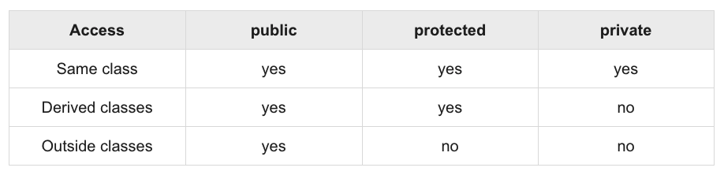
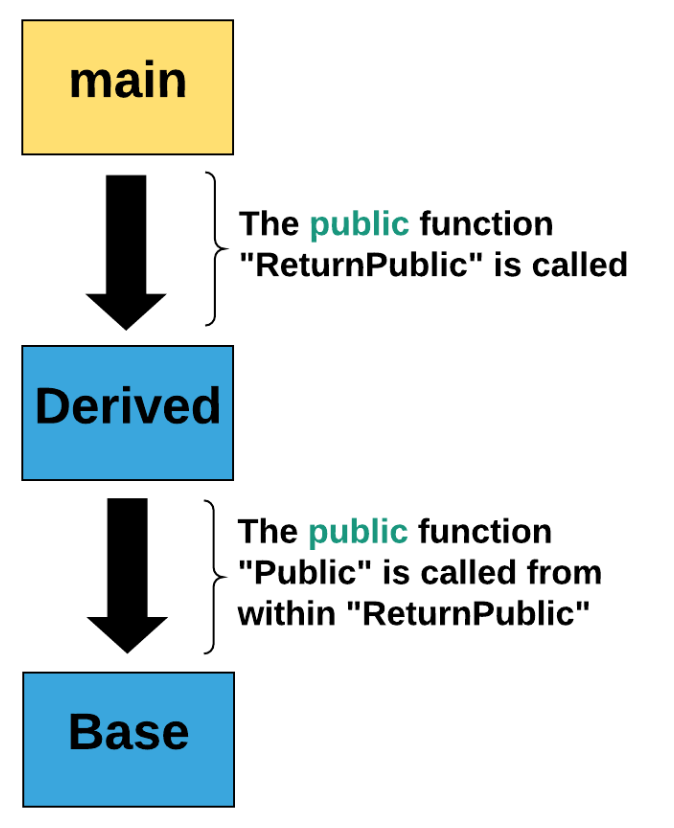
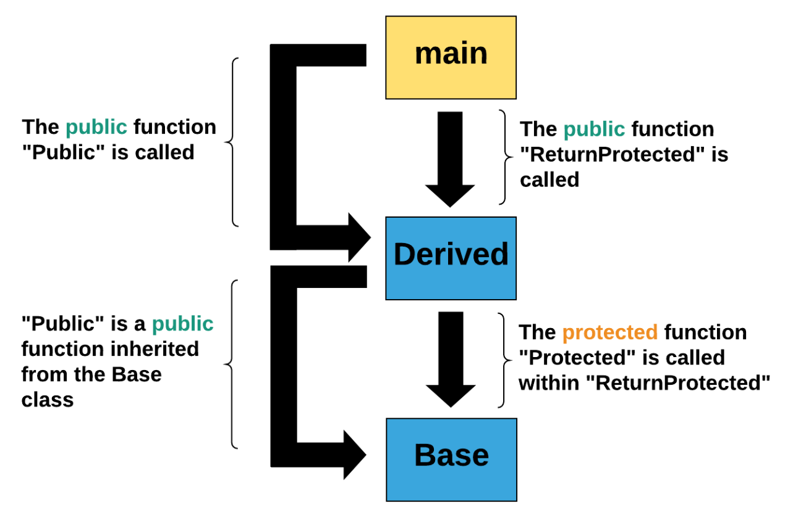
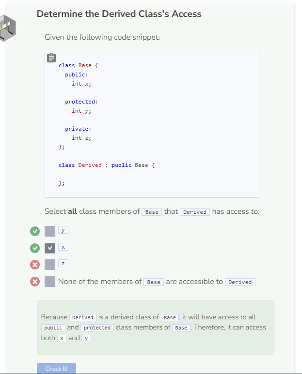

# Effects of Inheritance Types 1
## Access Modifiers Review
Before we can look at the effects of inheritance types, we will need to review some access modifier vocabulary:
- `private` - private members of a class can only be accessed by other members within the same class.
- `protected` - protected members of a class can be accessed by other members within the same class or by a derived class.
- `public` - public members of a class can be accessed by other members within the same class, by a derived class, or by an external or outside class.

The table below showcases these access modifiers’ effects.



Source: https://www.tutorialspoint.com/cplusplus/cpp_inheritance.htm

## Accessing Class Members
In the text editor, the `Base` class has already been defined. Within this base class, you’ll see that there is a **public** function, a **protected** function, and a **private** function. Add the following derived class to your code:

```cpp
//add class definitions below this line

class Derived : public Base {
  public:
    void ReturnPublic(string s) {
      Public(s_derived); //public function inherited from Base
    }
  
  private:
    string s_derived;
};

//add class definitions above this line
```

The derived class `Derived` has one public function and one private attribute and it publicly inherits all public and protected members of the base class `Base`. This means that it can call and use any functions or attributes of `Base` with the exception of anything that is private.

Next, add the following code into the main function:

```cpp
  //add code below this line
  
  string s_main;
  Derived dc;
  dc.ReturnPublic(s_main);

  //add code above this line
```

In `main`, a string `s_main` and a `Derived` object dc are created. Then `ReturnPublic()` is called on dc with s_main as the parameter. `ReturnPublic` is a `public` member function of the `Derived` class which takes a string as a parameter and calls the `Public` member function of the `Base` class on `s_derived`. The entire process sounds very complicated but can be explained visually in the flowchart below.



The reason why `main` is able to call `ReturnPublic` is due to the fact that `ReturnPublic` is a public member function within `Derived`.

```cpp
class Derived : public Base {
  protected:
    void ReturnPublic(string s) {
      Public(s_derived);
    }
  
  private:
    string s_derived;
};
```
When the `ReturnPublic` member function of `Derived` is protected, main is no longer able to access it. Remember, external classes can only access public members of other classes, unless it is a derived class. Derived classes can access protected members in addition to public ones.

Next, let’s change `Derived` and `main` to look like this:

```cpp
//add class definitions below this line

class Derived : public Base {
  public:
    void ReturnPublic(string s) {
      Public(s_derived); //public function inherited from Base
    }
  
    void ReturnProtected(string s) {
      Protected(s_derived); //protected function inherited from Base
    }
  
  private:
    string s_derived;
};

//add class definitions above this line
```

Notice how `main` can call `Public` and also `ReturnProtected` from `Derived` because those functions are public. Additionally, `Derived` can call the protected function `Protected` in `ReturnProtected` from `Base` because `Derived` is a derived class of `Base`.




