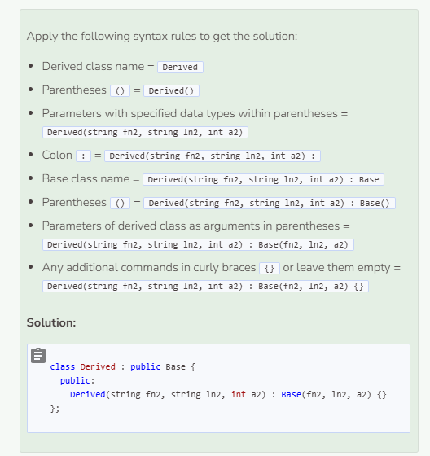

# Inheriting the Constructor
## How are Constructors Inherited?
Unlike functions and attributes, the constructor that is inherited by the derived class needs to get linked or associated with that of the base class. To connect the derived constructor to the base constructor, follow this syntax:
- Derived class name
- Parentheses `()`
- Parameters with specified data types within parentheses
- Colon `:`
- Base class name
- Parentheses `()`
- Parameters of derived class as arguments in parentheses
- Any additional commands in curly braces `{}` or leave them empty
 
Sample Code: `Constructor2(Param p1, Param p2) : Constructor1(p1, p2) {}`

Add the following code to the class definitions field:

```cpp
//add class definitions below this line

class Superhero : public Person {
  public:
    Superhero(string n2, int a2) : Person(n2, a2) {}
};

//add class definitions above this line
```

And the following to `main`:

```cpp
  //add code below this line

  Superhero s("Spider-Man", 16);
  s.ReturnPerson();

  //add code above this line
```

By associating the derived constructor with the base constructor, C++ is able to pass the parameters specified in the derived constructor as arguments of the base constructor. In the code above, the arguments `Spider-Man` and `16` are passed to the `Superhero` constructor and then transferred over to the `Person` constructor where they get assigned to `name` and `age` respectively. Then, the `ReturnPerson` function is used to print `name` which is now `Spider-Man` and `age` which is now `16`.

