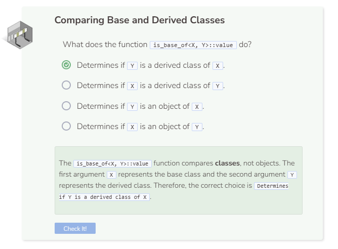

# Comparing Base & Derived Classes
## Determining a Derived Class’s Base Class
How do you determine if a derived class actually belongs to a base class? One common way to determine this is to use the `is_base_of<Base, Derived>::value` function. Just substitute `Base` with the name of the base class and `Derived` with the name of the derived class.

```cpp
  //add code below this line

  cout << boolalpha;
  cout << "B is derived from A: " << is_base_of<A, B>::value << endl;
  cout << "C is derived from B: " << is_base_of<B, C>::value << endl;
  cout << "A is derived from C: " << is_base_of<C, A>::value << endl;

  //add code above this line
```

Here is an example:

```cpp
  //add code below this line

  cout << boolalpha;
  cout << "Superhero is derived from Person: " << is_base_of<Person, Superhero>::value << endl;
  cout << "Animal is derived from Superhero: " << is_base_of<Superhero, Animal>::value << endl;
  cout << "Person is derived from Animal: " << is_base_of<Animal, Person>::value << endl;

  //add code above this line
```

You’ll notice that the function returns `true` if the derived class inherits from the base class and `false` when that is not the case.

## Determining an Object’s Base Class
Unfortunately, C++ has no built-in function to determine if an object is from a class that inherits from another class. Instead, use `typeid(<object_name>).name()` to try and extract the object’s type, and then use the `is_base_of<Base, Derived>::value` to see if that object’s class is derived from another specified class. Replace `<object_name>` with the name of the object.

Remove all existing code in main and add the following:

```cpp
  //add code below this line

  Superhero s;
  cout << "s is of type: " << typeid(s).name() << endl;

  //add code above this line
```

Your output may look something like `s` is of type: `9Superhero`. The `9` is just a number that is produced by the compiler, which can be ignored. Once you determine the object’s class, you can then compare that class to another class to see if it is a derived class.

```cpp
  //add code below this line

  Superhero s;
  cout << "s is of type: " << typeid(s).name() << endl;
  cout << boolalpha;
  cout << "Superhero is derived from Person: ";
  cout << is_base_of<Person, Superhero>::value << endl;

  //add code above this line
```

The functions provided above can help you determine an object’s class and compare it with another known class. There is unfortunately no function to determine an object’s base class directly.


