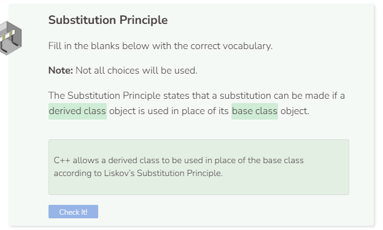

# Substitution Principle
## Substitution Principle
When one class inherits from another, C++ considers them to be related. They may contain different data types, but C++ allows a derived class to be used in place of the base class. This is called **Liskov’s Substitution Principle**. In the text editor you’ll notice that Superhero inherits from Person, but Animal does not. All classes have the Greeting function which prints a statement specific to the class.

```cpp
//add class definitions below this line

class Person {
  public:
    void Greeting() {
      cout << "I'm a Person" << endl;
    }
};

class Superhero : public Person {
  public:
    void Greeting() {
      cout << "I'm a Superhero" << endl;
    }
};

class Animal {
  public:
    void Greeting() {
      cout << "I'm an Animal" << endl;
    }
};

//add class definitions above this line
```

According to the Substitution Principle, an object of `Superhero` can be used in a situation that expects an object of `Person`. Add the `Substitution` function below which explicitly requires a parameter of a `Person` object.

```cpp
//add function definitions below this line

void Substitution(Person p) {
  p.Greeting();
}

//add function definitions above this line
```

Instantiate an object of `Superhero` and pass it to the `Substitution` function. Even though the object `s` has the wrong data type, the code should still work due to the Substitution Principle. Because `Superhero` is derived from `Person`, object `s` can be used in place of an object of type `Person`. Run the code to verify the output.

```cpp
  //add code below this line

  Superhero s;
  Substitution(s);

  //add code above this line
```

## The Substitution Principle is a One-Way Relationship
Let’s revise the `Substitution` function and `main` to look like below:

```cpp
//add function definitions below this line

void Substitution(Superhero s) {
  s.Greeting();
}

//add function definitions above this line
```

```cpp
  //add code below this line

  Person p;
  Substitution(p);

  //add code above this line
```

The code above produces an error stating that the object `p` cannot be converted to a `Superhero` object. Kind of like how a square is considered to be a rectangle, but a rectangle is not considered to be a square, inheritance works the same way. A `Superhero` object is considered to be a `Person` object, but a `Person` object is not considered to be `Superhero` object.

## Inheritance Can Be Extended
Inheritance can be extended, which means that a derived class can inherit attributes of another derived class. Revise the class definitions to look like below:

```cpp
//add class definitions below this line

class Person {
  public:
    void Greeting() {
      cout << "I'm a Person" << endl;
    }
};

class Hero : public Person {
  public:
    void Greeting() {
      cout << "I'm a Hero" << endl;
    }
};

class Superhero: public Hero {
  public:
    void Greeting() {
      cout << "I'm a Superhero" << endl;
    }
};

//add class definitions above this line
```

You’ll notice that we have an intermediate class called `Hero` which is a derived class of `Person`. The `Superhero` class is then derived from the `Hero` class. When there are multiple levels of inheritance, the immediate upper class is considered to be a direct base class and all higher classes are considered to be indirect base classes. This means that `Hero` is a direct base class of `Superhero` while `Person` is an indirect base class of `Superhero`. `Superhero` is still considered to be a derived class of both `Hero` and `Person`.

See what happens when you you revise the Substitution function and main to look like below:

```cpp
//add function definitions below this line

void Substitution(Person p) {
  p.Greeting();
}

//add function definitions above this line
```

```cpp
  //add code below this line

  Superhero s;
  Substitution(s);
  Hero h;
  Substitution(h);

  //add code above this line
```

Whether the object is of class `Superhero` or `Hero`, the `Substitution` function still works because both are derived classes of `Person`.


