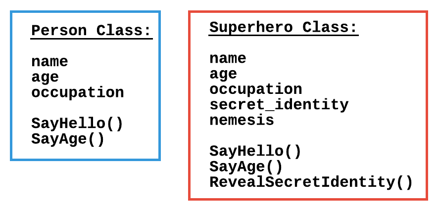
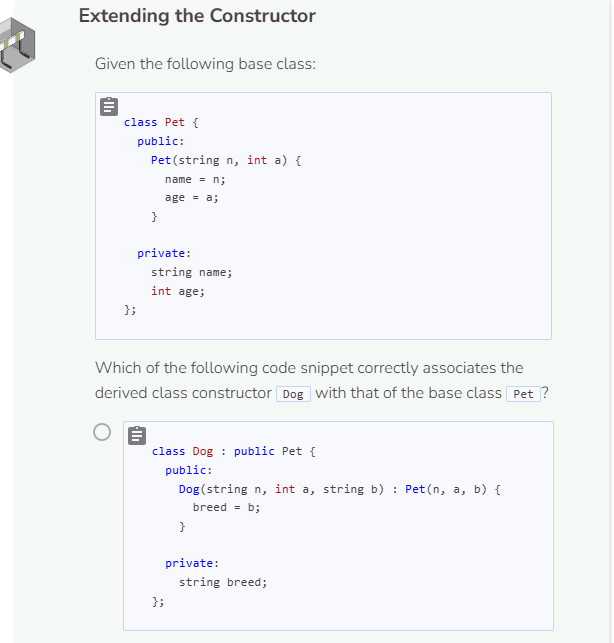
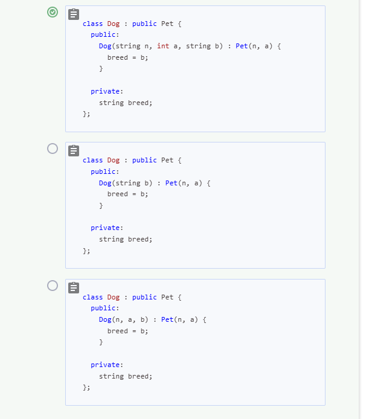
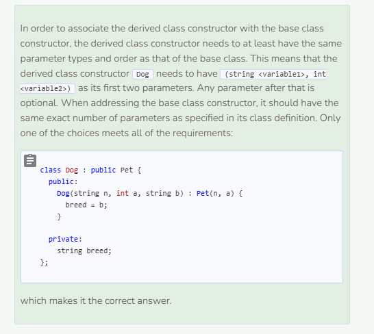

# Extending a Class
## Extending the Derived Class
The idea of inheritance is to borrow from a base class and then add on functionality. Up until now, we have talked about borrowing from a base class but have not gone into detail about adding additional functionality to the derived class. The process of adding functionality to a derived class is known as either extending or overriding. Extending a class means that new attributes and functions are given to the derived class. Let’s continue working with our `Person` and `Superhero` classes.



The code below will first associate the derived class constructor with the base class constructor. However, we want to add an additional attribute as a parameter to the derived class constructor. Doing so will extend the derived class because objects created will have 4 parameter attributes instead of 3. Additional getter and setter functions are also added to extend the derived class even further.

```cpp
//add class definitions below this line

class Superhero : public Person {
  public:
    Superhero(string n, int a, string o, string s) : Person(n, a, o) {
      secret_identity = s;
    }
  
    string GetSecretIdentity() {
      return secret_identity;
    }
  
    void SetSecretIdentity(string new_secret_identity) {
      secret_identity = new_secret_identity;
    }
  
  private:
    string secret_identity;
};

//add class definitions above this line
```

In `main`, instantiate a `Superhero` object and print out each of the attributes. You should see the three attributes from the `Person` class as well as the new attribute secret_identity.

```cpp
  //add code below this line

  Superhero hero("Spider-Man", 16, "student", "Peter Parker");
  cout << hero.GetName() << endl;
  cout << hero.GetAge() << endl;
  cout << hero.GetOccupation() << endl;
  cout << hero.GetSecretIdentity() << endl;

  //add code above this line
```

### Inheritance Is a One-Way Street
Inheritance shares attributes and functions from the `base` class to the `derived` class. When a `derived` class is extended, it cannot share the new additions with its `base` class. For example, in the code above, the `Superhero` class has access to the attributes `name`, `age`, and `occupation`, but `Person` does not have access to `secret_identity`.

## Extending a Class by Adding Unique Functions
Another way to extend a class is to create new functions that are unique to the derived class (besides getter and setter functions). Currently, the function `SayHello` will print the superhero’s name, but it will not print their secret identity. Create the function `RevealSecretIdentity` to print a greeting that reveals `SecretIdentity`.

```cpp
//add class definitions below this line

class Superhero : public Person {
  public:
    Superhero(string n, int a, string o, string s, string ne) : Person(n, a, o) {
      secret_identity = s;
      nemesis = ne;
    }
  
    string GetSecretIdentity() {
      return secret_identity;
    }
  
    void SetSecretIdentity(string new_secret_identity) {
      secret_identity = new_secret_identity;
    }
  
    string GetNemesis() {
      return nemesis;
    }
  
    void SetNemesis(string new_nemesis) {
      nemesis = new_nemesis;
    }
  
    void RevealSecretIdentity() {
      cout << "My real name is " << secret_identity << '.' << endl;
    }
  
  private:
    string secret_identity;
    string nemesis;
};

//add class definitions above this line
```

Now test out the newly added function.

```cpp
  //add code below this line

  Superhero hero("Spider-Man", 16, "student", "Peter Parker", "Doc Octopus");
  hero.RevealSecretIdentity();

  //add code above this line
```



