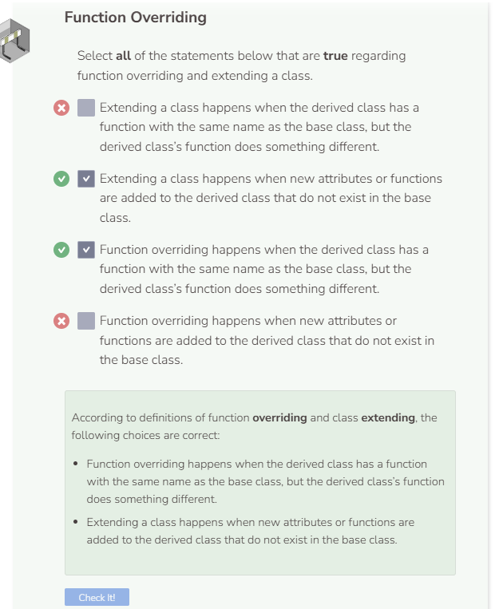

# Function Overriding
## Overriding a Function
Extending a class means adding new attributes or functions to the derived class. Another way to add new functionality to a derived class is through function overriding. Overriding a function means to inherit a function from the base class, keep its name, but change the contents of the function.

Extend the `Superhero` class by overriding the `SayHello` function. Remember, the `name` attribute is part of the base class and it is private, so you need to use the `GetName` function to access this attribute.

```cpp
    //add class definitions below this line
  
    void SayHello() {
      cout << "My name is " << GetName() << ", and criminals fear me." << endl;
    }
  
    //add class definitions above this line
```

Instantiate a `Superhero` object and call the `SayHello` function on it.

```cpp
  //add code below this line

  Superhero hero("Storm", 30, "Queen of Wakanda", "Ororo Munroe", "Shadow King");
  hero.SayHello();

  //add code above this line
```

### Differentiating Overriding and Extending
The difference between extending and overriding can be slight. Both approaches are used to make a derived class unique from the base class. However, overriding deals with changing a pre-existing function from the base class, while extending deals with adding new functions and attributes.

## What Happens to the Overridden Function?
If you can override a function from the base class, what happens to its original function? C++ defaults to the instance or object type. So `hero.SayHello()` will always use the function from the derived `Superhero` class. But that does not mean you cannot call `SayHello` from the base `Person` class. To call the original base class function, you can use `hero.Person::SayAge()` where hero represents the derived class object, Person represents the base class, and `SayAge` represents the base class function. The `::` is called the scope resolution operator and it is used to direct C++ to look for the function `SayAge` inside the `Person` class. Make sure you have the following class definitions in your code.

```cpp
    //add class definitions below this line
  
    void SayHello() {
      cout << "My name is " << GetName() << ", and criminals fear me." << endl;
    }

    void SayAge() {
      cout << "Age is just a number." << endl;
    }
  
    //add class definitions above this line
```

Then run the following commands in `main` to see the result.

```cpp
  //add code below this line

  Superhero hero("Storm", 30, "Queen of Wakanda", "Ororo Munroe", "Shadow King");
  hero.SayHello();
  hero.Person::SayHello();
  hero.SayAge();
  hero.Person::SayAge();
  
  //add code above this line
```

Note how in the code above, using the scope resolution operator causes the base class function to be called while not using it causes the derived class function to be called.

To prevent a derived class from overriding a base class function, you can use the key terms `virtual` and `final`. `virtual` goes in front of the function declaration name while `final` goes behind. Adding these key terms keeps you from overriding the functions in the `Superhero` class.



