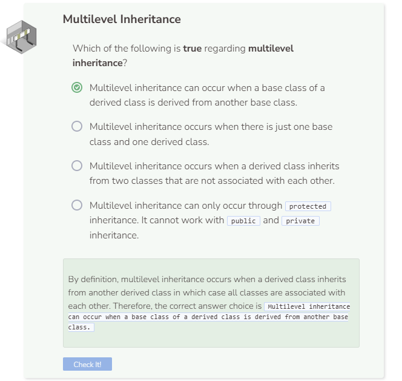

# Multiple Inheritance
## Multiple Inheritance
Multiple inheritance is a condition where a class inherits from more than one base class. C++ allows multiple inheritance for both associated and unassociated base classes; however, for this particular section, we will only go over multiple inheritance with associated base classes, meaning one base class is derived from another base class.

## Multilevel Inheritance
Multiple inheritance with associated base classes is called multilevel inheritance. This is a condition where a class inherits from more than one base class, but each base class is associated with each other. The image below shows `ClassC` inheriting from `ClassB`, which in turn inherits from `ClassA`. This is an example of multilevel inheritance.


The classes `Carnivore` and `Dinosaur` are already defined. `Carnivore` is the base class for `Dinosaur`. Create the `Tyrannosaurus` class which is a derived class of `Dinosaur`. The constructor for `Tyrannosaurus` takes a string and two doubles and gets associated with the constructor from the `Dinosaur` class.

```cpp
//add class definitions below this line

  class Tyrannosaurus : public Dinosaur {
    public:
      Tyrannosaurus(string d, double s, double w) : Dinosaur(d, s, w) {}
  };

//add class definitions above this line
```

Instantiate a `Tyrannosaurus` object with the appropriate arguments. This t-rex `tiny` is 12 meters tall, weighs 14 metric tons, and eats whatever it wants. Print the `size` attribute to make sure inheritance is working as expected.

```cpp
  //add code below this line

  Tyrannosaurus tiny("whatever it wants", 12, 14);
  cout << tiny.GetSize() << endl;

  //add code above this line
```


