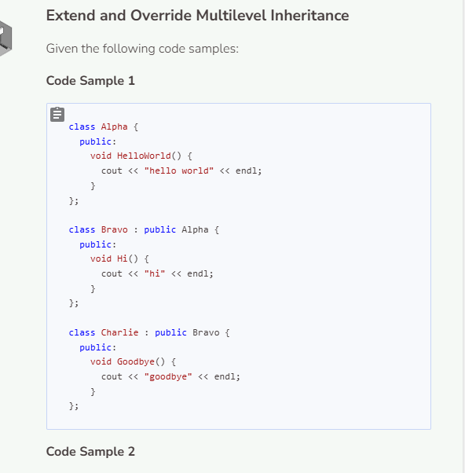
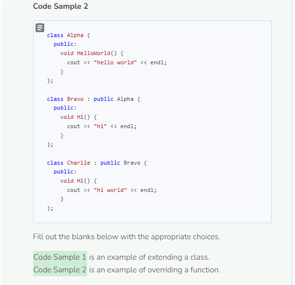
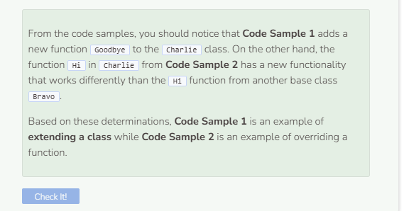

# Extending & Overriding Functions
## Extending a Class within Multilevel Inheritance
Multilevel inheritance works just like single inheritance except there are more than one derived class. Add the following code as class definitions in the text editor.

```cpp
//add class definitions below this line

class ClassC : public ClassB {
  public:
    void Bonjour() {
      cout << "Bonjour" << endl;
    }
};

//add class definitions above this line
```

Instantiate a `ClassC` object to call the `Bonjour` function. Then use the scope resolution operator `:` to invoke the `Hello` function from both `ClassB` and `ClassA`.

```cpp
  //add code below this line

  ClassC c;
  c.Bonjour();
  c.ClassB::Hello();
  c.ClassA::Hello();

  //add code above this line
```

## Overriding a Function within Multilevel Inheritance
Like extending a class, overriding a function works the same in multilevel inheritance as it does in single inheritance. Change `ClassC` so that it overrides the `Hello` function.

```cpp
//add class definitions below this line

class ClassC : public ClassB {
  public:
    void Hello() {
      cout << "Hello from Class C" << endl;
    }
};

//add class definitions above this line
```

Now replace the call to `Bonjour` with a call to `Hello`.

```cpp
  //add code below this line

  ClassC c;
  c.Hello();
  c.ClassB::Hello();
  c.ClassA::Hello();

  //add code above this line
```

Notice how calling the `Hello` function automatically defaults to the function within the object’s specified class. If you want to call the same function as specified from within another base class, simply use the scope resolution operator `:` as shown above.




