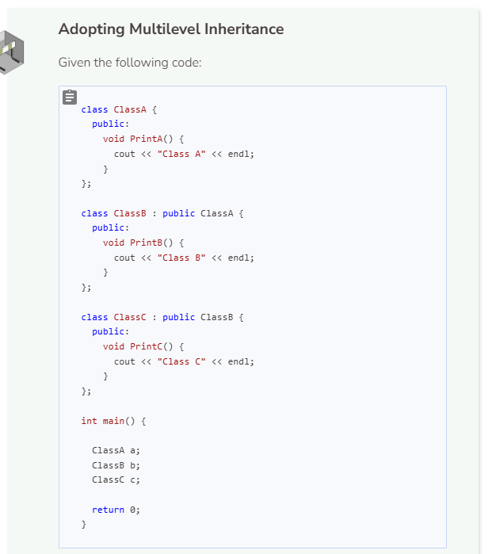
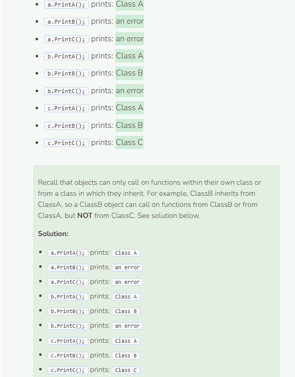

# Lab 2
## Lab 2 - Applying Multilevel Inheritance
Previously in Lab 1, we created the base class `Line` and the derived class `Box`. In this lab, we will create another derived class that inherits from `Box` directly and `Line` indirectly. This concept of a derived class inheriting from another derived class is called multilevel inheritance.

```cpp
#include <iostream>
using namespace std;

//add class definitions below this line

class Line {
  public:
    Line(int l) {
      length = l;
    }
  
    int GetLength() {
      return length;
    }
  
    void DrawLine() {
      for (int i = 0; i < length; i++) {
        cout << '*';
      }
      cout << endl;
    }
  
  private:
    int length;
};

class Box : public Line {
  public:
    Box(int l, int w) : Line(l) {
      width = w;
    }
  
    int GetWidth() {
      return width;
    }
  
    void DrawBox() {
      for (int i = 0; i < width; i++) {
        DrawLine();
      }
    }
  
  private:
    int width;
};

//add class definitions above this line

int main() {
  
  //add code below this line


  //add code above this line
  
  return 0;
  
}
```

Our new derived class is called `Pattern`. This class builds off of `Box` and `Line` by utilizing their getter functions `GetLength` and `GetWidth`. First we need to build the `Pattern` constructor which inherits the Box constructor exactly. Then we will create a new function called `DrawPattern` that will output a modified “box” with a pattern. Note that `Pattern` does not have any private members. It is simply an extension of the `Box` class.

```cpp
//add class definitions below this line

class Line {
  public:
    Line(int l) {
      length = l;
    }
  
    int GetLength() {
      return length;
    }
  
    void DrawLine() {
      for (int i = 0; i < length; i++) {
        cout << '*';
      }
      cout << endl;
    }
  
  private:
    int length;
};

class Box : public Line {
  public:
    Box(int l, int w) : Line(l) {
      width = w;
    }
  
    int GetWidth() {
      return width;
    }
  
    void DrawBox() {
      for (int i = 0; i < width; i++) {
        DrawLine();
      }
    }
  
  private:
    int width;
};

class Pattern : public Box {
  public:
    Pattern(int l, int w) : Box(l, w) {} 
  
    void DrawPattern() {
      for (int i = 0; i < GetLength(); i++) {
        if (i % 2 == 0) {
          for (int j = 0; j < GetWidth(); j++) {
            if ( (j % 2 == 0) ) {
              cout << '*';
            }
            else {
              cout << ' ';
            }
          }
          cout << endl;
        }
        if (i % 2 == 1) {
          for (int j = 0; j < GetWidth(); j++) {
            if ( (j % 2 == 0) ) {
              cout << ' ';
            }
            else {
              cout << '*';
            }
          }
          cout << endl;
        }
      }
    }
};

//add class definitions above this line
```

Rather than create a “box” of "lines", a “pattern” is created by specifying certain indices to output `*` while others output a white space (`' '`). In particular, this is the pattern (note the pattern starts at index 0 for both rows and columns):
* even row + even column = `*`
* even row + odd column = `' '`
* odd row +even column = `' '`
* odd row + odd column = `*`
Try the following code in main to see the output.

```cpp
  //add code below this line

  Pattern pattern(10, 10);
  pattern.DrawPattern();

  //add code above this line
```


