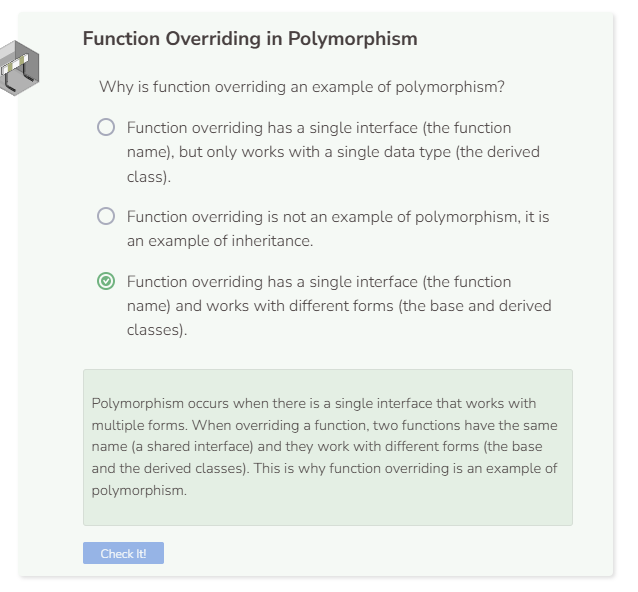

# Function Overriding
## What is Polymorphism?
Polymorphism is a concept in object-oriented programming in which a single interface takes different forms (polymorphism means “many forms”). Often this means similar operations are grouped together with the same name. However, these operations with the same name will produce different results. You have already encountered a few examples of polymorphism. Enter the following code into the IDE.

```cpp
  //add code below this line
   
  int a = 5;
  int b = 10;
  cout << (a + b) << endl;
    
  string c = "5";
  string d = "10";
  cout << (c + d) << endl;
  
  bool e = true;
  bool f = false;
  cout << (e + f) << endl;
  
  //add code above this line
```

Notice how the plus operator (`+`) can add together two numbers, concatenate two strings, and add two booleans. You have a single interface (the plus operator) taking different forms — one that works with integers, another that works with strings, and even one that works with booleans. This is an example of polymorphism.

### Operator Overloading
Because the plus operator can work with different forms, we can say that it is overloaded. C++ overloads this operator by default. However, a user cannot manually overload an operator.

## Function Overriding
Function overriding is another example of polymorphism that you have already seen. Overriding a function means that you have two functions with the same name, but they perform different tasks. Again you see a single interface (the function name) being used with different forms (the base class and the derived class). Create the following classes.

```cpp
//add class definitions below this line

class Alpha {
  public:
    void Show() {
      cout << "I am from class Alpha" << endl;
    }
};

class Bravo: public Alpha {
  public:
    void Show() {
      cout << "I am from class Bravo" << endl;
    }
};

//add class definitions above this line
```

Then instantiate an `Alpha` object and call the `Show` function.

```cpp
  //add code below this line

  Alpha test_object;
  test_object.Show();
    
  //add code above this line
```

As expected, the script prints `I am from class Alpha`. Now change the line of code in which you instantiate the object `test_object` to a `Bravo` object like below. Make no other changes and run the code again.

```cpp
  Bravo test_object;
```

Now the script prints `I am from class Bravo`. The function call did not change, but the output did. A single interface (the `Show` function) works with multiple forms (the `Alpha` and `Bravo` data types). This is why function overriding is an example of polymorphism.


