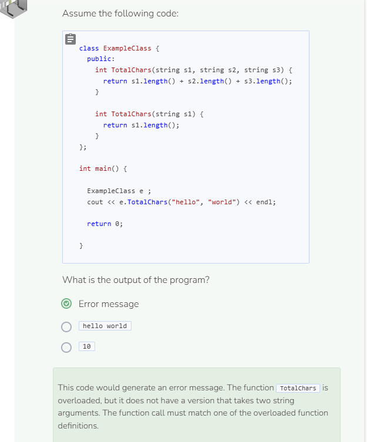

# Function Overloading
## Function Overloading
Function overloading is another example of polymorphism. Function overloading occurs when you have a single function name that can take different sets of parameters. Imagine you want to write the function `Sum` that can sum up to three numbers. The math involved with three parameters is slightly different than two parameters, which is different from 1 parameter, etc. Traditionally, if you declare a function that takes three parameters but only pass two, C++ will throw an error message. Instead, let’s create a class that has two `Sum` functions; one with two parameters and another with three parameters.

```cpp
//add class definitions below this line

class TestClass {
  public:
    int Sum(int n1, int n2, int n3) {
      return n1 + n2 + n3;
    }

    int Sum(int n1, int n2) {
      return n1 + n2;
    }
};

//add class definitions above this line
```

Create an object of type `TestClass` and call both versions of the `Sum` function. Be sure you are passing three arguments for one function and two arguments for the other.

```cpp
  //add code below this line

  TestClass tc;
  cout << tc.Sum(1, 2, 3) << endl;
  cout << tc.Sum(1, 2) << endl;

  //add code above this line
```

C++ looks at the number and types of arguments and, as long there is a matching function definition, runs the code without an error. Defining the same function with different sets of arguments is called overloading. It is also an example of polymorphism.

## Overloading the Constructor
C++ will also allow you to overload the constructor so that objects are instantiated in a variety of ways. The `Person` class has a default constructor (no arguments) and a constructor with three arguments.

```cpp
//add class definitions below this line

class Person { 
  public: 
    Person() {}

    Person(string na, int nu, string s) {
      name = na;
      number = nu;
      street = s;
    }

    string Info() {
      return (name + " lives at " + to_string(number) + ' ' + street + '.');
    }
  
  private:
    string name;
    int number;
    string street;
};

//add class definitions above this line
```

When you create a `Person` object with no arguments, the `Info` function still works. However, the information that is printed may look jarring since C++ will use left-over “junk” memory data to fill in for variables that are not initialized. You can also instantiate an object with three arguments. Like function overloading, constructor overloading is a form of polymorphism.

```cpp
  //add code below this line
  
  Person p1;
  Person p2("Calvin", 37, "Main Street");
  cout << p1.Info() << endl;
  cout << p2.Info() << endl;
    
  //add code above this line
```

### Random Values
Unlike other programming languages, C++ does not automatically initialize variables that are not initialized by the user. This is done to preserve memory. Thus, you might get "randomly" generated data for certain uninitialized variables. Run the code several more times and you'll notice different values will be printed.

C++ automatically uses the default constructor when there are no constructors defined. If, however, a constructor exists, the object that gets instantiated must contain the same number of arguments as specified by that constructor's parameters. Otherwise, an error will be produced.


