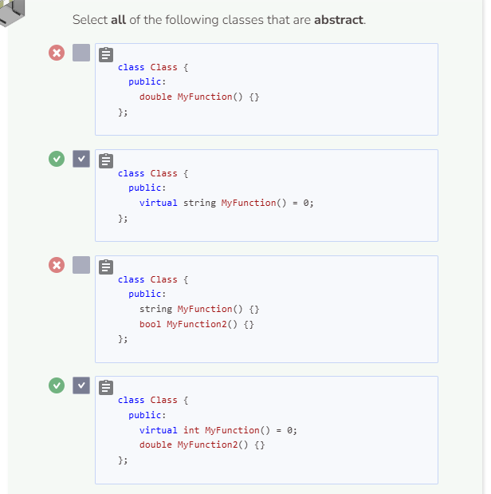
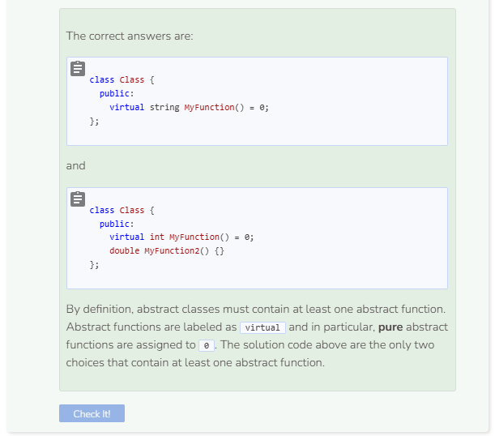

# Abstract Functions
## Abstract Functions
Another form of polymorphism in C++ involves abstract functions. These functions, however, require knowledge of abstract classes. So before we continue the discussion on polymorphism, we need to first talk about abstract classes.

### Concrete Classes
Any class that is not an abstract class is considered to be a concrete class. You do not need to use a keyword to indicate that a class is concrete.

A defining characteristic of an abstract class is that an abstract class has at least one abstract, or pure virtual, function. An abstract function is a function that is defined as being equal to `0` in the base class, but is expected to be redefined in the derived class.

## Abstract (Pure Virtual) Functions
When will there be a need for abstract functions? Abstract functions are used when the derived classes are expected to use a particular abstract function from the base class differently. Let’s take a look at a classic example of the Shape class.

```cpp
//add class definitions below this line

class Shape {
  public:
    virtual double Area() = 0;
};

//add class definitions above this line
```

As seen in the above code, the virtual function `Area` is defined as being equal to `0`. We do this because we expect classes that are derived from `Shape` to have `Area` functions that behave differently. For example, calculating the area of a Triangle object is different from calculating the area of a Rectangle object. Thus, we define Area as an abstract function in the base class `Shape`. Note that when you redefine abstract functions in the derived classes, you do not include the virtual keyword nor assign the function to `0`. Let’s define our classes further.

```cpp
//add class definitions below this line

class Shape {
  public:
    virtual double Area() = 0;
  
    double GetBase() {
      return base;
    }
  
    void SetBase(double new_base) {
      base = new_base;
    }
  
    double GetHeight() {
      return height;
    }
  
    void SetHeight(double new_height) {
      height = new_height;
    }
  
  protected:
    double base;
    double height;
};

class Triangle : public Shape {
  public:
    Triangle(double b, double h) {
      base = b;
      height = h;
    }
  
    double Area() {
      return base * height / 2;
    }
};

class Rectangle : public Shape {
  public:
    Rectangle(double b, double h) {
      base = b;
      height = h;
    }
  
    double Area() {
      return base * height;
    }
};

//add class definitions above this line
```
You can see above that two classes are derived from `Shape`, the `Triangle` class and the `Rectangle` class. Also notice how Shape contains additional getters and setters as well as protected attributes. We encapsulate them as protected in order for our derived classes to access them. This way, we don’t have to declare additional attributes in `Triangle` and `Rectangle`.

Next, let’s test our code in `main`.

```cpp
  //add code below this line
  
  Triangle t(4, 4);
  cout << t.Area() << endl;
  Rectangle r(4, 4);
  cout << r.Area() << endl;
  
  //add code above this line
```

As expected, the code returns the correct calculations for the `Triangle` and `Rectangle` objects.

You cannot create an object of an abstract class nor can you call an abstract function. This is why using encapsulation and inheritance is important in redefining functions so that they can be used in derived classes. Because abstract functions get redefined and used differently, they are considered to be a concept of polymorphism.



