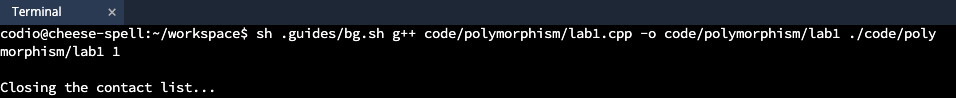
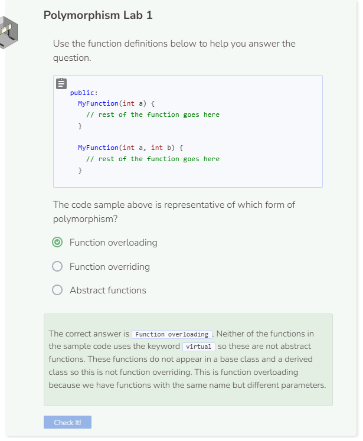

# Lab 1
## Lab 1
This lab will focus on using polymorphism while interacting with a contact list. There will be a main class `Contacts` that controls the “view” the user sees and responds to user input. The contact information (personal and work) will be an instance of the `Information` class.

## The Contacts Class
This lab is built around the `Contacts` class, which has four attributes:
* `view` - This string attribute controls what the user sees. When the value for `view` changes, the information changes. There are four different views.
  * `List view `- Shows the list of all of the contacts.
  * `Information view` - Shows the work and personal information for a particular contact.
  * `Add view` - Add information for a new contact.
  * `Quit view` - Leave a message for the user and then end the program.
* `names` - Vector of strings that stores the names of each person in the contact list.
* `titles` - Vector of strings that stores the titles for each person in the contact list.
* `workPhoneNumbers` - Vector of strings that stores the work phone numbers for each person in the contact list.
* `workEmails` - Vector of strings that stores the work email addresses for each person in the contact list.
* `personalPhoneNumbers` - Vector of strings that stores the personal phone numbers for each person in the contact list.
* `personalEmails` - Vector of strings that stores the personal email addresses for each person in the contact list.
* `choice` - This string attribute represents input from the user and is used to change view.
* `index` - This integer attribute keeps track of the particular contact whose information is to be displayed.
* `length` - This integer attribute keeps track of the length of the above vectors.

To put polymorphism into practice, we are going to create the abstract class `Information`. This will have the pure abstract functions `DisplayInfo` and `AddInfo`. The `Contacts` class inherits from `Information`, and therefore it must override the `DisplayInfo` and `AddInfo` functions.

```cpp
//add class definitions below this line

class Information {
  public:
    virtual void DisplayInfo() = 0;
    virtual void AddInfo() = 0;
};

class Contacts : public Information {
  public:
    void DisplayInfo() {

    }
 
     void AddInfo() {

    }
};

//add class definitions above this line
```

Add the attributes and constructor for the `Contacts` class. For testing purposes, set `view` to `"quit"`. We will change this to a more appropriate value later on. The other attributes do not need a value when instantiating the object. Instantiate each vector attribute, set `choice` to an empty string, and set `index` and `length` to `0`. Additionally, add the `Display` function, which we will go in more detail later on.

```cpp
//add class definitions below this line

class Information {
  public:
    virtual void DisplayInfo() = 0;
    virtual void AddInfo() = 0;
};

class Contacts : public Information {
  public:
    Contacts() {
      view = "quit";
      names = {};
      titles = {};
      workPhoneNumbers = {};
      workEmails = {};
      personalPhoneNumbers = {};
      personalEmails = {};
      choice = "";
      index = 0;
      length = 0;
    }

    void DisplayInfo() {   

    }

    void AddInfo() {

    }
  
    void Display() {

    }

    private:
      string view;
      vector<string> names;
      vector<string> titles;
      vector<string> workPhoneNumbers;
      vector<string> workEmails;
      vector<string> personalPhoneNumbers;
      vector<string> personalEmails;
      string choice;
      int index;
      int length;
};

//add class definitions above this line
```

## The Display Function
The `Display` function is designed to be a loop that runs until the user tells the program to end. The function checks the value of the `view` attribute and calls the appropriate function that displays the information for each view. Since the loop is `while (true)`, be sure to include a `break` statement otherwise the loop would never stop (C++ would eventually stop the program with an error message). Fill out the `Display` function like below.

```cpp
    void Display() {
      while (true) {
        if (view==("list")) {
        } 
        else if (view==("info")) {
          DisplayInfo();
        } 
        else if (view==("add")) {
          cout << " " << endl;
          AddInfo();
        } 
        else if (view==("quit")) {
          cout << ("\nClosing the contact list...\n");
          break;
        }
      }
    }
```

## Starting the Other Functions
The `Display` function calls three other functions; `DisplayInfo` and `AddInfo` have already been declared. Trying to test the code would cause your program to crash as the `ShowList` function has not yet been defined. Create another empty function `ShowList` just as was done with `DisplayInfo` and `AddInfo`. We will come back later and add working code to each function. However, to get your code to run we must provide a definition for virtual functions in your base class.

```cpp
    void DisplayInfo() {

    }

    void AddInfo() {

    }

    void ShowList() {

    }
```

## Testing Your Code
Before moving on to the next part of the script, we want to check that our code is working. To do that, instantiate a `Contacts` object and call the `Display` function.

```cpp
  //add code below this line

  Contacts contacts;
  contacts.Display();
    
  //add code above this line
```

Run your program. Because the `view` attribute is `"quit"`, the script should immediately display a message and then stop. Your output should look something like this.




