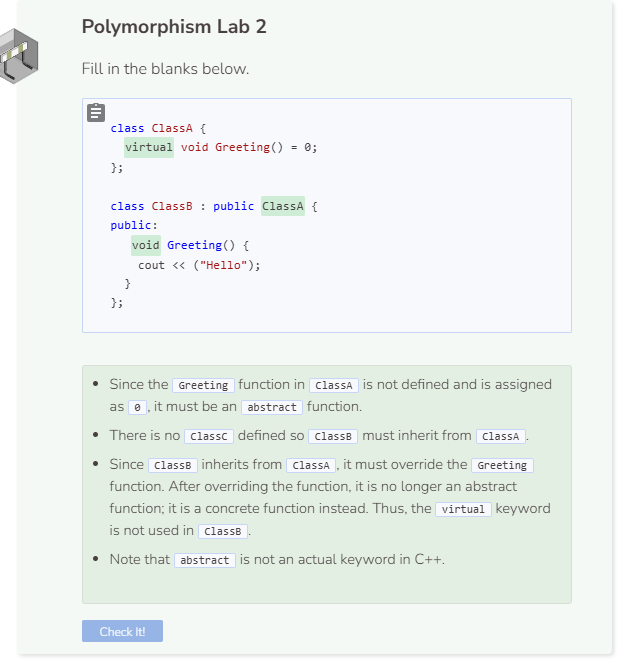

# Lab 2
## Adding a Contact
The first thing we need to do is to change the default view when a `Contacts` object is instantiated. The list view should be the first view shown to the user. Change the value for `view` from `"quit"` to `"list"` in the constructor. The rest of the constructor should not be changed.

```cpp
  public:
    Contacts() {
      view = "list";
      // rest of the constructor remains unchanged
    }
```

Next we want to modify the `ShowList` function to show the list of people in the contact list. There are two possible states for the list view: the list is empty or there are contacts in the list. When the list is empty, the user will be provided with the choice to add a contact or quit the program. Use a conditional to represent these two states. For now, set `view` to `"quit"` in the `else` branch.

The print statement is to add a blank line for legibility. We also need a cin object to collect input from the user. If `length` is `0`, then present the user with a choice. Store their input in `choice`. The `.tolower()` function will convert the user choice to a lowercase letter. This will make comparisons easier. Remember, C++ is case sensitive; `q` and `Q` are not the same. By forcing all input to lowercase, we only need to test for the lowercase letter. The `ShowList` function ends by calling another function to handle the user’s choice.

```cpp
  void ShowList() {
    cout << endl;
    char sc;
    if (length == 0) {
      cout << ("(A)dd a new contact \n(Q)uit \n> ");
      cin >> sc;   
      choice = putchar(tolower(sc));
    } 
    else {
      view = "quit";
    }
    HandleChoice();   
  }
```

## Handling User Choices
Every time the user makes a choice, we want to evaluate that choice and perform the appropriate action. In this case, the user can choose between adding a contact or quitting the program. Notice that `view` only changes to `"add"` if `"a"` is entered and we are in list view. We only want to add new contacts from the list view.

```cpp
  void HandleChoice() {
    if (choice==("q")) {
      view = "quit";
    } 
    else if (choice==("a") && view==("list")) {
      view = "add";
    }
  }
```

## Adding a Contact
When the user enters `"a"`, we need to create a new contact. To do this, we are going to modify the `AddInfo` function. Use `cout` and the `getline` function to ask the user to enter the name, personal phone number, personal email, work title, work phone number, and work email, and then temporarily store that information. Each piece of information should go into the corresponding vector attribute after. Notice that we include `cin >> ws` within getline because by doing so, we are able to consume the whitespace `ws`. Once the information has been added, increase the `length` attribute and revert back to the list view.

```cpp
  void AddInfo() {
    cout << endl;
    string sc2;
    cout << ("Enter their name: ");
    getline(cin >> ws, sc2);
    string name = sc2;
    names.push_back(name);

    cout << ("Enter their personal phone number: ");
    getline(cin >> ws, sc2);
    string personalPhone = sc2;
    personalPhoneNumbers.push_back(personalPhone);

    cout << ("Enter their personal email: ");
    getline(cin >> ws, sc2);
    string personalEmail = sc2;
    personalEmails.push_back(personalEmail);

    cout << ("Enter their work title: ");
    getline(cin >> ws, sc2);
    string title = sc2;
    titles.push_back(title);

    cout << ("Enter their work phone number: ");
    getline(cin >> ws, sc2);
    string workPhone = sc2;
    workPhoneNumbers.push_back(workPhone);

    cout << ("Enter their work email: ");
    getline(cin >> ws, sc2);
    string workEmail = sc2;
    workEmails.push_back(workEmail);
    length++;
    view = "list";
  }
```

## Testing Your Code
The first thing we need to do is to change the default view when a `Contacts` object is instantiated. The list view should be the first view shown to the user. Change the value for `view` from `"quit"` to `"list"` in the constructor. The rest of the constructor should not be changed.

```cpp
  int GetLength() {
    return length;
  }
```

Now call print the result from the `GetLength` function.

```cpp
  //add code below this line
  
  Contacts contacts;
  contacts.Display();
  cout<< contacts.GetLength()<< endl;
  
  //add code above this line
```

Run the program and enter `a` when prompted, then add the following contact:

```
Rachel Kim
555 123-4567
rachel_k@personalMail.com
Senior Software Engineer
555 890-1234
rkim@workMail.com
```

If everything worked properly, your program should print `1` in the terminal as there is one person in our contact list.

