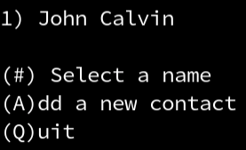
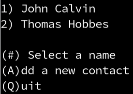
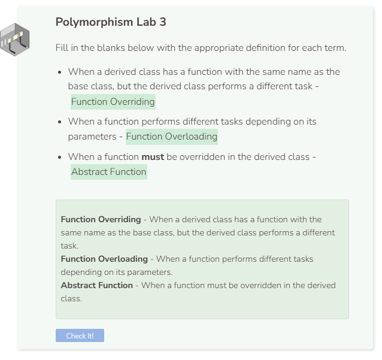

# Lab 3
## Displaying the List View
Now that we can add a contact to the list, we will want to show all of the contacts in the list.

But before doing that, we need to remove the print statement at the end of the script. The final two lines of code should look like this:
```cpp
  //add code below this line

  Contacts contacts;
  contacts.Display();

  //add code above this line
```

We are going to iterate through the list of contacts and print the name. To help users select a contact, a number will appear before each name. This way, the user types the number, and the contact’s information appears. Previously, the `cin` object stored the user input as a `char`, but since we want the user to be able to input numbers now, we have to change the input `sc` to a string instead. Then we create a loop in which `sc` gets iterated and each character will be converted into lowercase and added to the string `choice`. In the else branch function, create a for loop to go from `0` to `length`. We want a number followed by the name. The numbers should start at 1, so print the loop index plus 1 followed by the element from the `names` vector. After displaying the list of names, ask the user to make a selection. Entering a number will show all of the information about a contact. After `HandleChoice` is called, be sure to set choice back to an empty string; otherwise, the user’s input will continue to be stored in `choice` and negatively affect the acceptable input requirement.

```cpp  
void ShowList() {
    cout << endl;
    string sc;
    if (length == 0) {
      cout << ("(A)dd a new contact \n(Q)uit \n> ");
      cin >> sc;
      for (char c : sc) {
        choice += (tolower(c));
      }
    } 
    else {
      for (int i = 0; i < length; i++) {
        cout << (i + 1 ) <<  ") " <<  names.at(i) << endl;
      }
      cout << ("\n(#) Select a name \n(A)dd a new contact\n(Q)uit \n> ");
      cin >> sc;
      for (char c : sc) {
        choice += (tolower(c));
      }
    }
    HandleChoice();
    choice = "";
  }
```

## Handling Numeric Input
Add an `else if` branch to the `HandleChoice` function that asks if the user input is numeric (remember, the `cin` object now stores user input as a `string`) and if the user is in the list view. If yes, then convert the user input to an integer, subtract 1, and store it in the variable `num`. Remember, we added one to the loop index in the `ShowList` function. If the user made a mistake in entering the number, the script will crash if you try to access an index that is outside of the vector. So we need to verify that the number is between 0 and `length`. Finally, set `index` to `num` and set view to `"info"`.

```cpp
  void HandleChoice() {
    if (choice==("q")) {
      view = "quit";
    } 
    else if (choice==("a") && view==("list")) {
      view = "add";
    }
    else if (IsNumeric(choice) && view==("list")) {
      int num = (stoi(choice) - 1);
      if (num >= 0 && num < length) {
        index = num;
        view = "info";
      }
    } 
  }                                  
```

We need to create the boolean helper function `IsNumeric` which takes the user input and determines if they entered a number. First see if the user input (a string) is empty. Return `false` if either condition is true. Then try to convert the `string` to an `integer`. If this works, return `true`. If C++ throws an exception because the string cannot be converted to an integer, then return `false`. Since `IsNumeric` is a helper function, you should encapsulate it as `private`.

```cpp
  bool IsNumeric(string s) {
    int value;
    
    if (s == "") {
      return false;
    }
    
    try {
      value = stoi(s);
      return true;
    } 
    catch (runtime_error& e) {
      return false;
    }
  }
```

## Testing Your Code
Before moving on to the next part of the program, we want to check that our code is displaying all of the contacts in the list. To do that, enter two different contacts. The first one is:

```
John Calvin
555 111-2222
john.calvin@email.net
Philosopher
555 333-4444
jcalvin@work.org
```
You should see a list that looks like this:



Now add a second contact to the list:
```cpp
Thomas Hobbes
555 666-7777
t_hobbes@email.net
Philosopher
555 888-9999
tom_hobbes@work.org
```

Your program should now show the following output:




