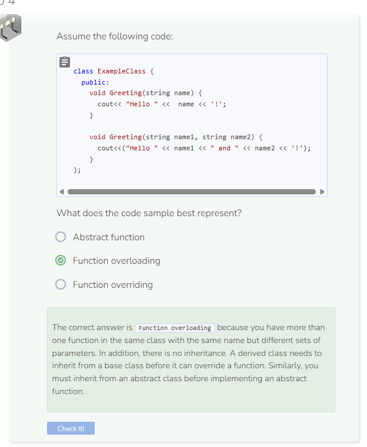

# Lab 4
## Displaying Contact Info
The next step is to display the contact information for a selected contact.

On the previous page, we already modified `HandleChoice` to deal with numeric input. So let’s update the `DisplayInfo` function to display the information. Print the elements from each vector using the attribute `index`. After the information is displayed, change `view` back to `"list"` and then call `ShowList`.

```cpp
  void DisplayInfo() {
    cout<< endl;
    cout<<names.at(index)<<endl;
    cout<<"Personal email address: " << personalEmails.at(index)<<endl;
    cout<<"Personal phone number: " << personalPhoneNumbers.at(index)<<endl;
    cout<<"Work title: " << titles.at(index)<<endl;
    cout<<"Work email address: " << workEmails.at(index)<<endl;
    cout<<"Work phone number: " << workPhoneNumbers.at(index)<<endl;
    view = "list";
    ShowList();
  }
```

## Testing Your Code
This program should be complete now. To test it, add at least two contacts. Select one of the contacts by entering the correlated number. Keep entering a number to display the relevant contact information, `a` to add additional contacts, or `q` to quit the program.

